# Multi-homed BGP (iBGP Core + OSPF Underlay)

Lab was built using VMware Workstation with Cisco Modeling Labs v2.8.1 

All switches and/or routers in this lab are running IOS XE images virtualized or containered


# Overview:

This lab demonstrates the design, implementation, and validation of a multi-homed BGP network using iBGP with route reflectors and OSPF as the underlay. Traffic manipulation is performed using Local Preference to influence outbound path selection, and Equal-Cost Multi-Path (ECMP) behavior is observed. The lab includes failure simulation by removing an edge router, exposing a next-hop reachability issue that resulted in traffic loss despite valid BGP routes. The issue was resolved through consistent next-hop-self configuration, resulting in failover success. 

This project highlights the interaction between BGP and IGP, the importance of next-hop resolution, and how policy and design choices impact real-world network resilience.

*A perspective from someone new to learning BGP*

# Topology:

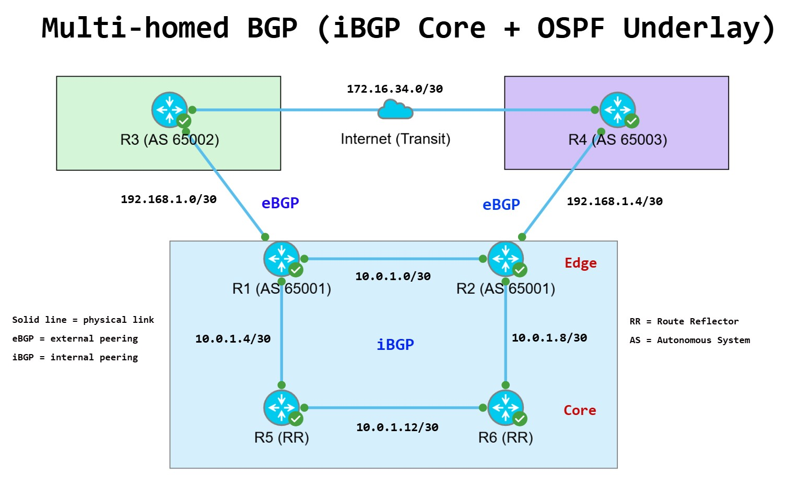


## Objectives:

Goals:

- Learn how eBGP and iBGP work together

- Dive into iBGP pathing, loopbacks, next-hop-self, neighbors and reflectors

- Control outbound traffic using local preference

- Ensure resilient failover when an edge router fails

- Understand control-plane vs data-plane behavior

- Learn how an overlay protocol and an underlay protocl cooperate together for a multi-layer network (vs a typical flat network that I'm used to)

<br>

# Scenarios 

1) Incomplete iBGP configuration on R1 

2) Local Preference in iBGP

3) Simulate R2 with a complete hardware failure - completely offline. 

<br>

## Configurations:

```
enable secret cisco
hostname {}
no ip domain lookup

line console 0
logging synchronous
exec-timeout 0 0
password cisco
login

line vty 0 4
logging synchronous
exec-timeout 15 0
password cisco
login
transport input ssh

copy running-config startup-config 
```

Grouping router names based on function to help keep a mental model (adjacent numbers = same role)

R1, R2 = edge 
<br>R5, R6 = internal
<br>R3, R4 = ISPs

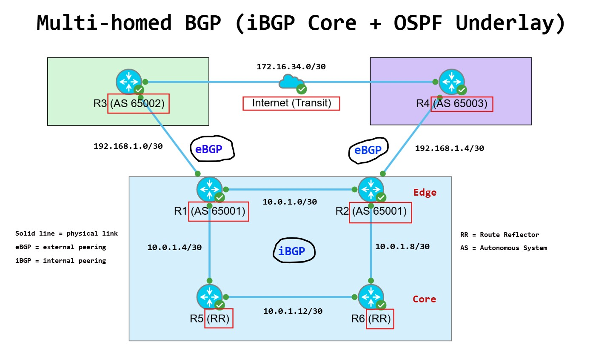

We configure loopback addresses on all routers in the topology. These loopbacks will serve BGP in both identity and peering endpoints. Like other routing protocols of various types, loopback interfaces are great for reliability and stability for overhead control plane mechanisms. 

R1 = 1.1.1.1/32
<br>R2 = 1.1.1.2/32
<br>R3 = 1.1.1.3/32
<br>R4 = 1.1.1.4/32
<br>R5 = 1.1.1.5/32
<br>R6 = 1.1.1.6/32

```
interface loopback0
ip address 1.1.1.X 255.255.255.255
```

We'll configure IPv4 addresses on all the router interfaces, as well as a 'no shut' to get the physical ports up.

Networks

```
R1 <> R3 - 192.168.1.0/30
R2 <> R4 - 192.168.1.4/30
R1 <> R2 - 10.0.1.0/30
R1 <> R5 - 10.0.1.4/30
R2 <> R6 - 10.0.1.8/30
R5 <> R6 - 10.0.1.12/30
R3 <> R4 - 172.16.34.0/30
```

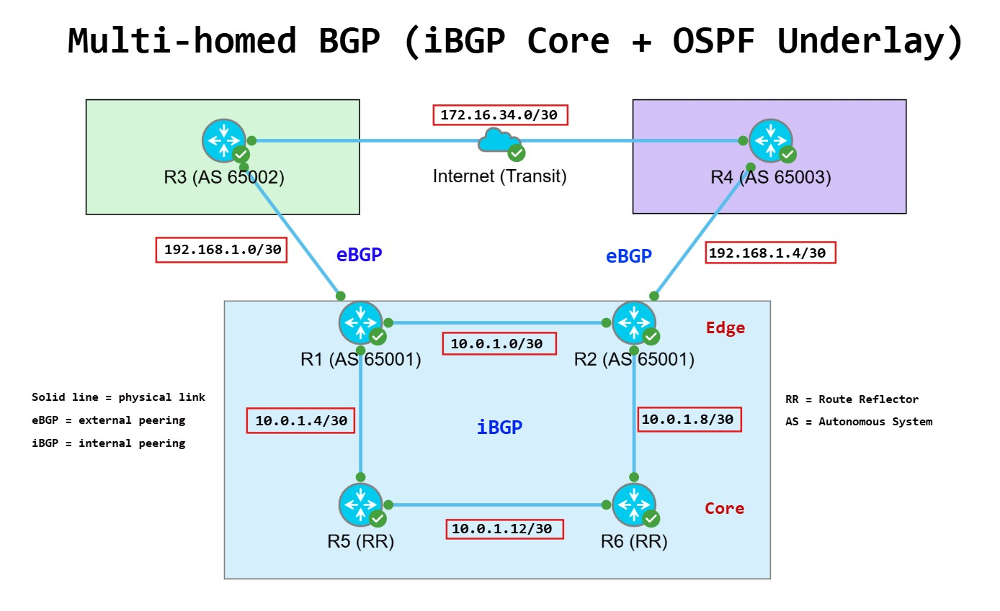

IP addresses

```
R1 - E0/0 - 192.168.1.2
R1 - E0/1 - 10.0.1.1
R1 - E0/2 - 10.0.1.5

R2 - E0/0 - 192.168.1.6
R2 - E0/1 - 10.0.1.2
R2 - E0/2 - 10.0.1.9

R5 - E0/0 - 10.0.1.6
R5 - E0/1 - 10.0.1.13

R6 - E0/0 - 10.0.1.10
R6 - E0/1 - 10.0.1.14

R3 - E0/0 - 192.168.1.1
R3 - E0/1 - 172.16.34.1

R4 - E0/0 - 192.168.1.5
R4 - E0/1 - 172.16.34.2
```

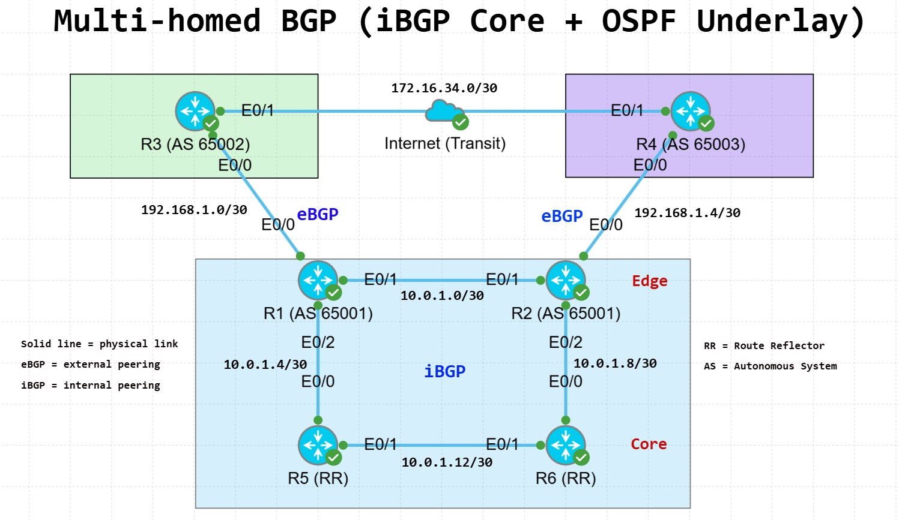


```
configure terminal
interface E0/{X}
ip address x.x.x.x 255.255.255.252
no shutdown
```

We'll run OSPF for underlay inside the enterprise.

Input on all iBGP internal routers (R1, R2, R5, R6) - These OSPF network commands will apply OSPF on all interfaces inside the enterprise, EXCEPT the two eBGP edge interfaces on R1 & R2 -- connecting to AS 65002 and AS 65003 respectively.

```
conf terminal
router ospf 1
network 10.0.1.0 0.0.0.255 area 0
network 1.1.1.0 0.0.0.255 area 0
```
- Because we will run iBGP on top in this lab, we can consider this OSPF domain to be our 'underlay' and the iBGP 'overlay'. However, in a small enterprise with only a single default gateway to the WAN, OSPF is just considered the routing protocol - NOT an underlay, because nothing is sitting on top of it making the policy and next-hop decisions. 

We can see both loopback addresses and 10.0.0.0/8 subnetted for OSPF routes. 

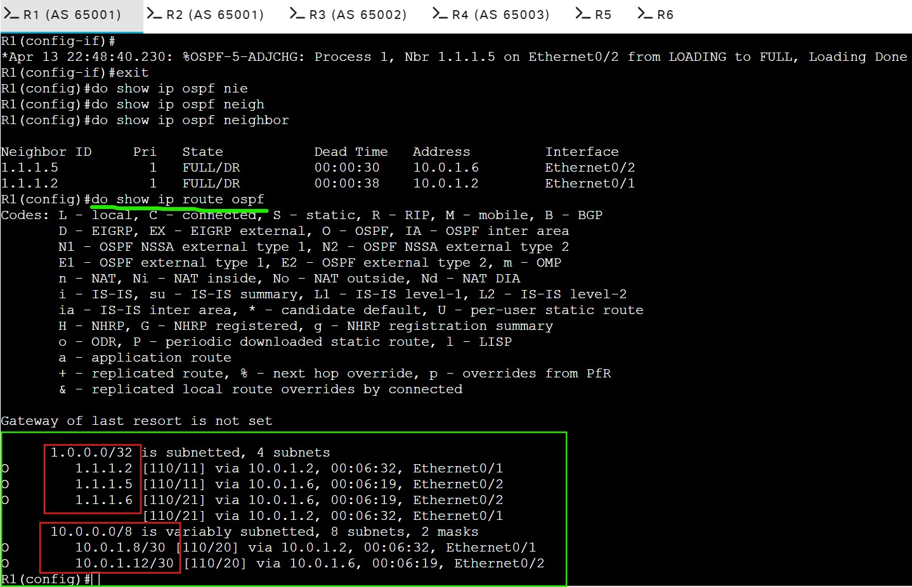


*While learning more about BGP, I realized iBGP requires full-mesh because iBGP-learned routes are NOT advertised to other iBGP peers. This requires the mesh, and while we could add more links for this lab easily, a full mesh in a large iBGP environment doesn't scale well. Which is why Route Reflectors are used as a method to bypass this traditional iBGP rule, where RRs are configured to advertise iBGP routes to other client peers* 

- I thought R1 and R2 at the edge would be obvious choices to serve as RRs - so that R5 and R6 learn all routes. But in practice, I read it's actually better to split the responsibilities of your network devices. 

- We don't have to have EVERYTHING riding on the stability of R1 and R2 as they are already handling the eBGP. We'll configure R5 and R6 in the enterprise core as the RRs, so that all 4 iBGP routers can communicate and learn all internal routes.

Adding first iBGP neighbor R2. The 'remote-as' command defines what AS the neighbor belongs to. 

The AS number in command will determine whether the routers establish an eBGP or iBGP session. 

We also need the 'update-source' command to tell router to use loopback0 address when talking to BGP neighbors

R1
```
router bgp 65001
  neighbor 1.1.1.2 remote-as 65001
  neighbor 1.1.1.2 update-source Loopback0
  neighbor 1.1.1.5 remote-as 65001
  neighbor 1.1.1.5 update-source Loopback0
```

If we need to verify BGP neighbors we can use commands such as:

```
show ip bgp neighbors
show ip bgp summary
```

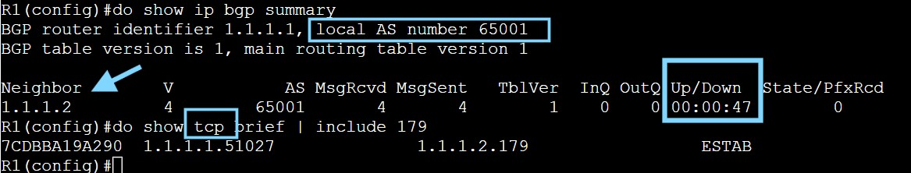

You can see the Up/Down time column and 'show tcp brief' output. R1 and R2 have now established a TCP session together (Layer 4)

Let's finish iBGP neighbor commands. And we'll add route reflector commands on R5 and R6 below:

R2
```
router bgp 65001
  neighbor 1.1.1.1 remote-as 65001
  neighbor 1.1.1.1 update-source Loopback0
  neighbor 1.1.1.6 remote-as 65001
  neighbor 1.1.1.6 update-source Loopback0
```

R5
```
router bgp 65001
  neighbor 1.1.1.1 remote-as 65001
  neighbor 1.1.1.1 update-source Loopback0
  neighbor 1.1.1.6 remote-as 65001
  neighbor 1.1.1.6 update-source Loopback0
  neighbor 1.1.1.1 route-reflector-client
```

R6
```
router bgp 65001
  neighbor 1.1.1.2 remote-as 65001
  neighbor 1.1.1.2 update-source Loopback0
  neighbor 1.1.1.5 remote-as 65001
  neighbor 1.1.1.5 update-source Loopback0
  neighbor 1.1.1.2 route-reflector-client
```

Each router now has 2 neighbors - but we don't add a third or full-mesh which is what would be required. Instead, we use route reflector commands on R5 and R6 which will make the iBGP complete. 

All four routers are configured for iBGP in AS 65001 and neighbors are Up:

However, we don't have 3 neighbors and iBGP hasn't fully propagated. iBGP will NOT pass routes from one iBGP neighbor to another. Route reflectors will do this for us.

Commands to config R5 and R6 as route reflectors in the iBGP domain. 

R5 example:
```
router bgp 65001
 neighbor 1.1.1.1 route-reflector-client
``` 

What this command does on R5 for example: 

"If I learn routes from R1, I am allowed to reflect them to other peers (like R6)" 

Below you can see the neighbor session go down and back up with R1 to apply the new RR logic to the iBGP session. 

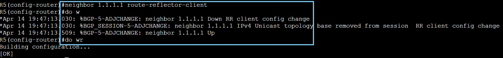

- Because RR advertisements are not limited to a single hop, the advertisements can traverse multiple hops (however the router at each hop must be allowed/configured to advertise the route - which is where the route reflector command is required.  

- Learning more about BGP - it's an important distinction that even though we have OSPF, Local, Connected routes in R1's RIB, these are separate from iBGP that has it's own table. Right now there are zero routes. BGP doesn't automatically inject routes, they have to be defined. 

Injecting R1 & R2's loopback0 as a route -- apply on R1 and R2:
```
router bgp 65001
 network 1.1.1.1 mask 255.255.255.255

router bgp 65001
 network 1.1.1.2 mask 255.255.255.255
```

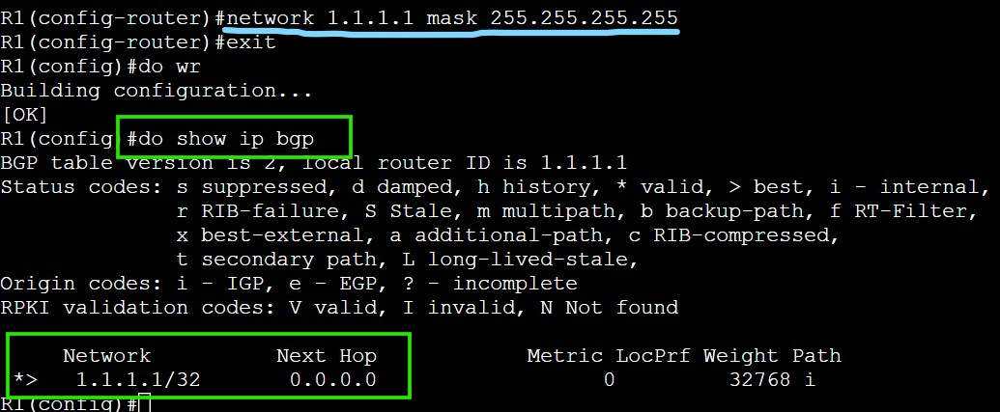

- The 'route reflectors' aren't advertising BGP neighbor information - they are advertising any injected routes into the BGP routing table. Network Layer Reachability Information (NLRI). We inject the loopback0 route for each of the 4 routers, and we should have 4 loopback0 networks in the BGP table.  

R1's BGP table now shows all 4 networks. We achieved this WITHOUT using a iBGP full-mesh -- using route reflectors instead. 

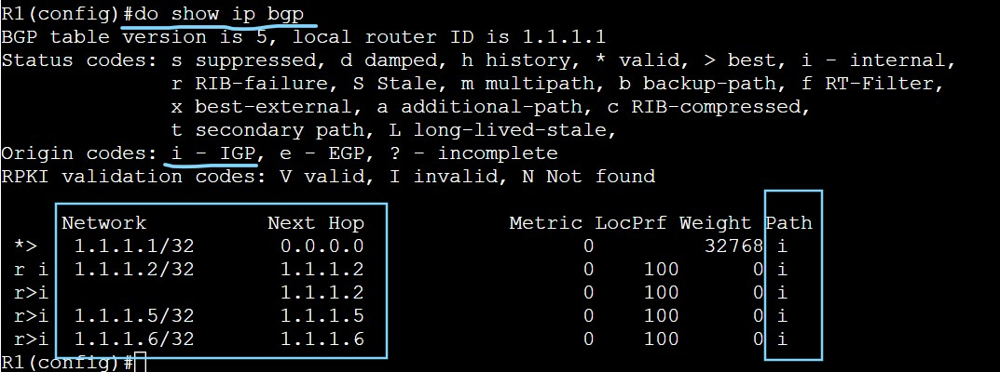

- To create a solid mental model, we take a peek at R1's routing table below. We see that loopback network addresses are injected into R1's RIB. Why? Because earlier we added TWO network OSPF commands on the four routers. Example, R1 has network 1.1.1.0 added to the OSPF configuration. 

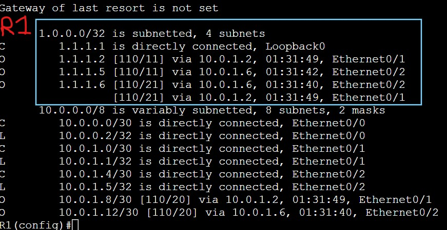

If we somehow lost our OSPF underlay routes (bad), traffic would blackhole because iBGP's control plane would believe the routes still exist.

## Configuring eBGP 

### We also have an eBGP link between R3 and R4 to simulate internet transit - which will allow us to fully test change behavior and failover scenarios later on.

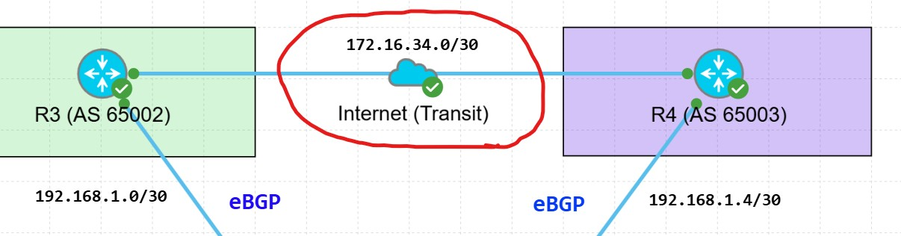

R1
```
router bgp 65001
neighbor 192.168.1.1 remote-as 65002
```

R2
```
router bgp 65001
neighbor 192.168.1.5 remote-as 65003
```

R3
```
router bgp 65002
neighbor 192.168.1.2 remote-as 65001
neighbor 172.16.34.2 remote-as 65003
```

R4
```
router bgp 65003
neighbor 192.168.1.6 remote-as 65001
neighbor 172.16.34.1 remote-as 65002
```

We're telling R1 & R2 : “That directly connected neighbor is in a DIFFERENT AS = eBGP session”

We performed the same BGP command on R3 and R4 autonomous systems (with different values for IP and AS #)

*ignore the 10.0.0.0 address in image below - it was used before changing to 192*

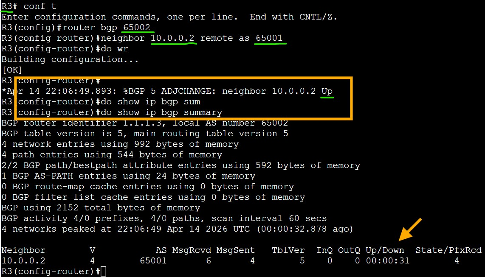

- Our eBGP is configured - similar to before we need a route injected into our eBGP table in hopes to see it propagate into the iBGP AS. Let's now take a look at R1's BGP table. 

- First thing we notice is that our eBGP next hops are using the underlay IP addresses, instead of loopbacks. Why? eBGP uses the directly connected interface IP as the next-hop by default. For eBGP sessions, it is assumed neighbors are directly connected. 

- We also added a link between R3 and R4 to help simulate break scenarios and path changes. We'll also add more network statements in our AS 65001 so R3 and R4 learn routes back to the enterprise iBGP area. 

R1
```
router bgp 65001
network 10.0.1.0 mask 255.255.255.252
network 10.0.1.4 mask 255.255.255.252
network 10.0.1.12 mask 255.255.255.252
```

R2
```
router bgp 65001
network 10.0.1.0 mask 255.255.255.252
network 10.0.1.8 mask 255.255.255.252
network 10.0.1.12 mask 255.255.255.252
```

In this 'show ip bgp' output on R3/4, we can see the underlay 10.0.1.x networks added to our BGP table. We now have redundant hops back to the iBGP area and connectivity can be tested end-to-end.

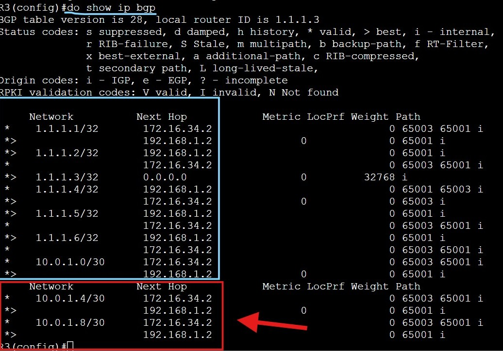

We use 'next-hop-self' BGP command on R1 and R2 -- so that they're advertised routes/NLRIs (Network Layer Reachability Information) will now include (and force) the next hop as their loopback0 addresses. 

Result: Core internal iBGP routers R5 and R6 will now receive routes/NRLI with accurate next hop addresses back towards to R1 and R2, respectively.

R1
```
neighbor 1.1.1.5 next-hop-self
```

R2
```
neighbor 1.1.1.6 next-hop-self
```

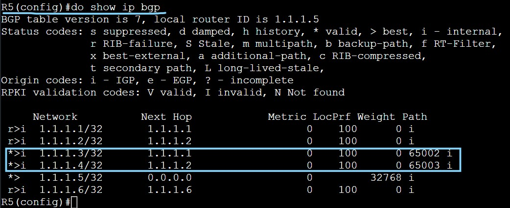

<br>
<br>
<br>

# Troubleshooting: Multi-Condition Connectivity Failure

During testing, end-to-end connectivity between ASes failed despite BGP sessions appearing healthy. Initial troubleshooting was misleading because two separate issues existed simultaneously, and each was tested and ruled-out separately.

The first issue involved overlapping internal addressing (10.0.0.0/8 - design mistake), while the second was a missing return path from the external AS back into the iBGP domain. Each problem alone did not fully explain the failure, leading to incorrect assumptions during early troubleshooting.

The breakthrough came after watching ICMP logs using `debug ip icmp` on edge routers. Echo requests and replies were partially visible, indicating that traffic was reaching the destination but failing on the return path. This revealed that both issues might be related.

After correcting the addressing conflict and restoring proper underlay reachability (OSPF) for return traffic, we had full end-to-end connectivity. 

This scenario demonstrated a classic multi-condition failure, where independent issues combined to create a more complex and misleading problem.

**Key takeaway:** Troubleshooting multiple issues can coexist — and validating fixes in isolation may not fix the problem unless all all issues are resolved simultaneously.

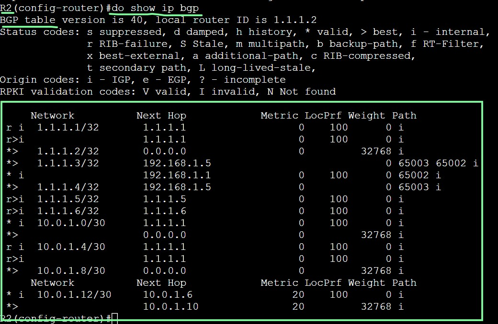

Let's move on to break/change scenarios. Controlled chaos. Observe behavior. 

<br>
<br>

***************************************************************************************

# Scenario 1) Incomplete iBGP configuration on R1 - missing the 'next-hop-self' command for neighbor R5. 

Before missing config -- R5 can send packets to R3 with R1 as the next hop (verify traceroute):

Traceroute confirms next hop:

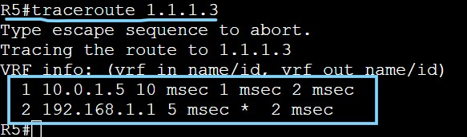

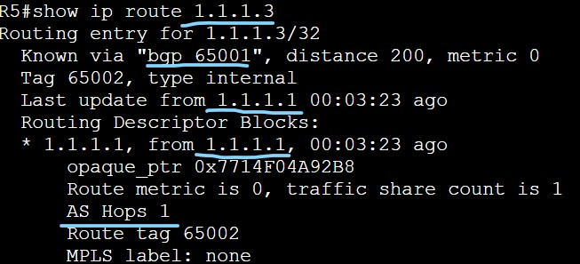

<br>
 
action on R1:
```
router bgp 65001
no neighbor 1.1.1.5 next-hop-self
```

With the incomplete iBGP config on R1 - I expected R5 to fail at sending some traffic bound for R3 AS 65002 -- but instead our edge routers provide 2 paths out of the enterprise network -- so R5 is still able to get packets to R3 with iBGP's control plane help. 

With R1's missing 'next-hop-self' command for neighbor R5, this is what we see:

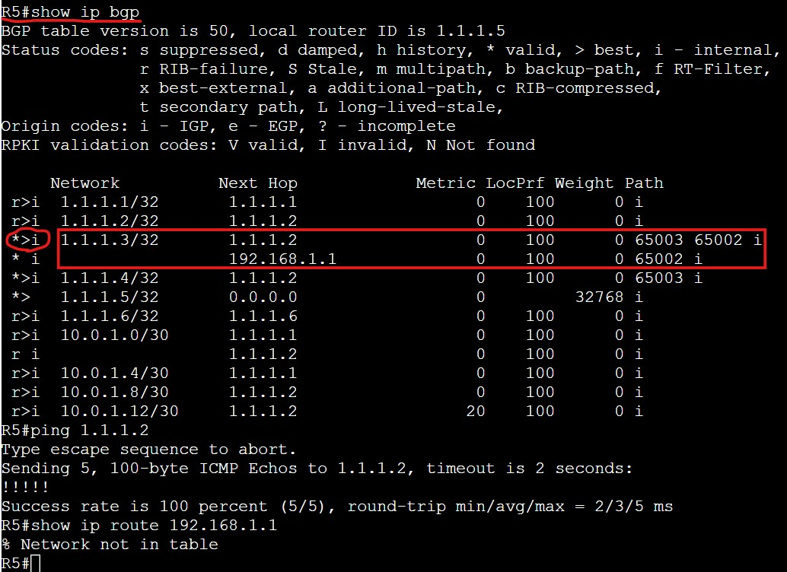

As you can see in traceroute below - something really cool happened. After losing R1 was a next hop - R5 failed over into an ECMP (Equal Cost Load Balancing) situation because there are 2 internal paths to get outside via R2. R5 can still get to R3 AS 65002 by traversing through R4 AS 65003 and over the simulated 'inet transit'. I didn't foresee this. 

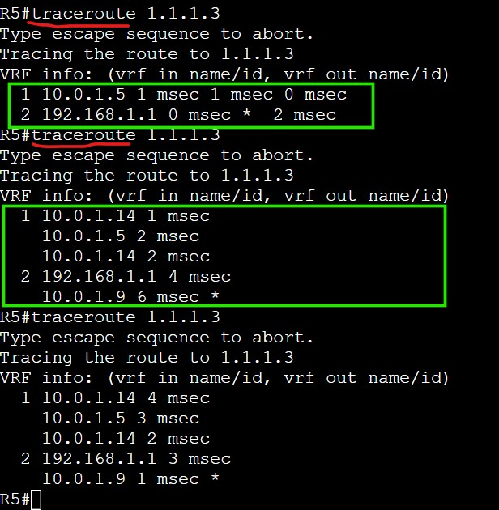

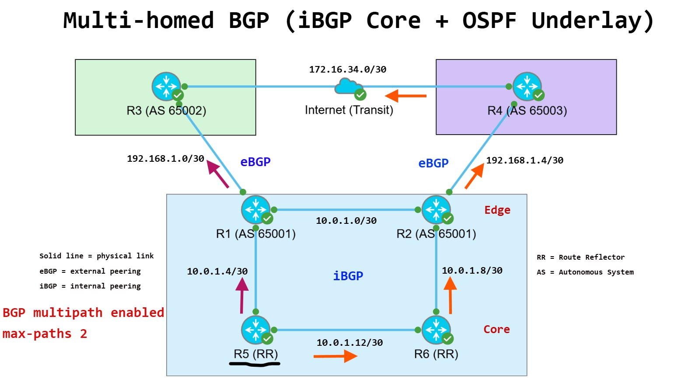

BGP doesn’t control the full path -- IGP decides how to reach the next-hop.

So when next-hop isn’t clean (like R1 loopback):

The network starts doing weird but valid things

<br>
<br>

***************************************************************************************

# Scenario 2) Local Preference in iBGP

In this scenario, R6 (AS 65001) is used as the source of traffic, with R3 (AS 65002) as the destination. R6 also functions as one of the Route Reflectors in the topology (along with R5).

The goal is to observe how modifying Local Preference within iBGP changes path selection when multiple outbound BGP exits are available.

All commands and verification outputs are taken from the perspective of R6.

Rather than guessing values, we define a clear routing policy by selecting a preferred exit point. Local Preference is used.

**Local Preference characteristics:**
<br>Higher value = more preferred path
<br>Propagated within the local AS (iBGP only)
<br>Typically set inbound on the receiving router

At baseline, R6 has equal-cost paths (ECMP) to reach R3 via:
<br>R1 > R3  
<br>R2 > R4 > Transit > R3

R6 BGP view
```
show ip bgp 1.1.1.3
```

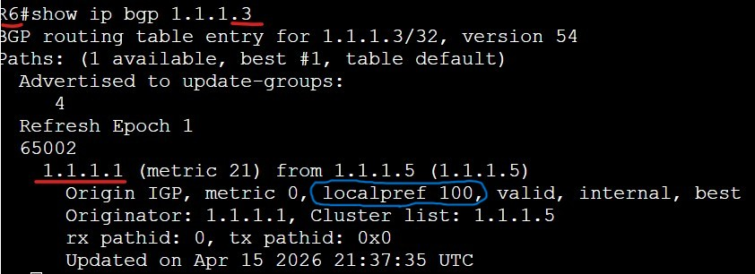

R6 Routing table
```
show ip route 1.1.1.3
```

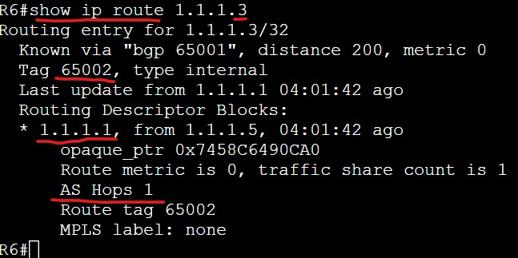

R6 Traceroute - We can see in the traceroute output that R6 is using ECMP because there are multiple equal cost paths to R3 (1.1.1.3) (AS 65002) 

```
traceroute 1.1.1.3 source 1.1.1.6
```

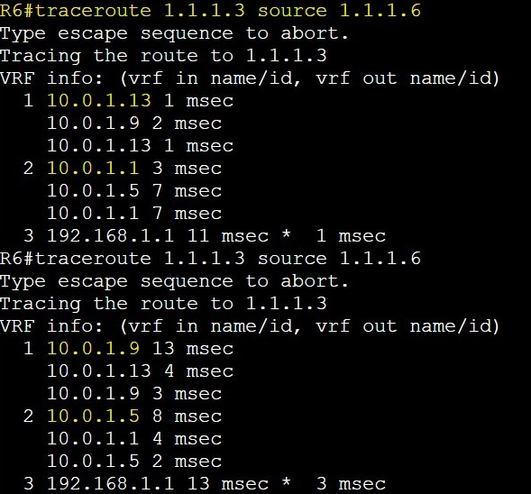


Now we want:
<br>Routes learned via R2 to have higher (better) local-pref
<br>R6 to send exiting traffic out R2 edge
<br>Compared to the same routes learned via R5 (which ultimately points to R1 → R3) 

R6 config to apply the route-map policy:

```
route-map PREFER-R2 permit 10
set local-preference 200
exit

router bgp 65001
neighbor 1.1.1.2 route-map PREFER-R2 in
```
<br>
<br>

## *unforeseen complication and learning experience* -- Yes I want traffic from R6 to exit out R2 > R4 AS 65003. And we configured R6 with a higher local preference on inbound routes learned from R2 (1.1.1.2).

However, we can see in R2's BGP ouput, R2 is actually learning route to R3 from R1 > R5 reflector > R6 reflector > R2. Which means... R6 is currently receiving routes to R3 (1.1.1.3) from R1 and R5 reflector. So the above change we made did nothing to affect the path from R6 to R3. 

Let's try to simulate forcing our enterprise traffic sourcing from R6 to leave the AS through R2 > R4 eBGP link. That will require us to change something on R2 as well. 

R6 can’t prefer R2 unless R2 prefers its own exit first

So we start at the source of truth: R2

On R2, we’ll boost local-pref for routes learned from R4. Any route R2 learns from R4 (eBGP link) will prefer that link for outgoing traffic. 

R2:
```
route-map PREFER-R4 permit 10
set local-preference 200
exit

router bgp 65001
neighbor 192.168.1.5 route-map PREFER-R4 in
```

Let's look at the output now on R2 -- You can see outgoing path to 1.1.1.3 now takes 192.168.1.5 (R4)

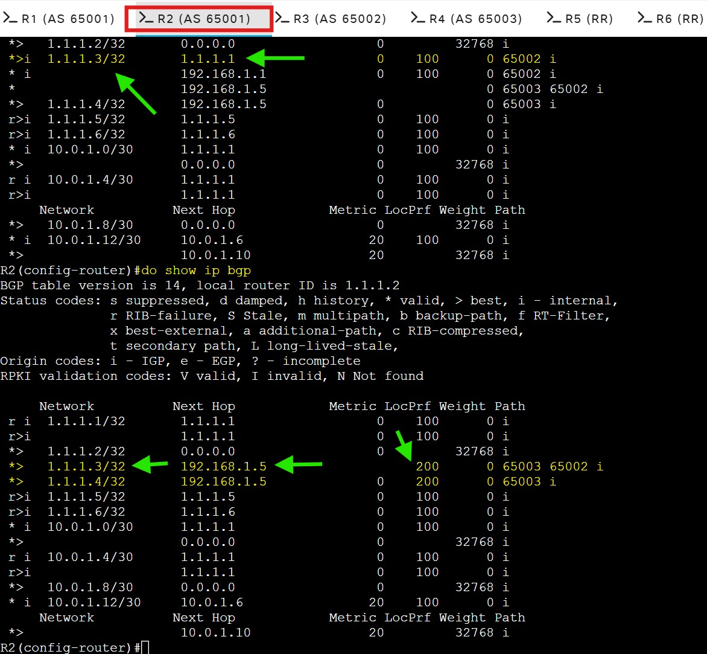

<br>

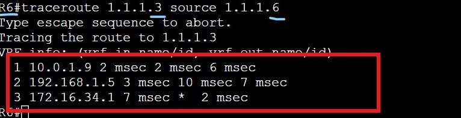

<br>

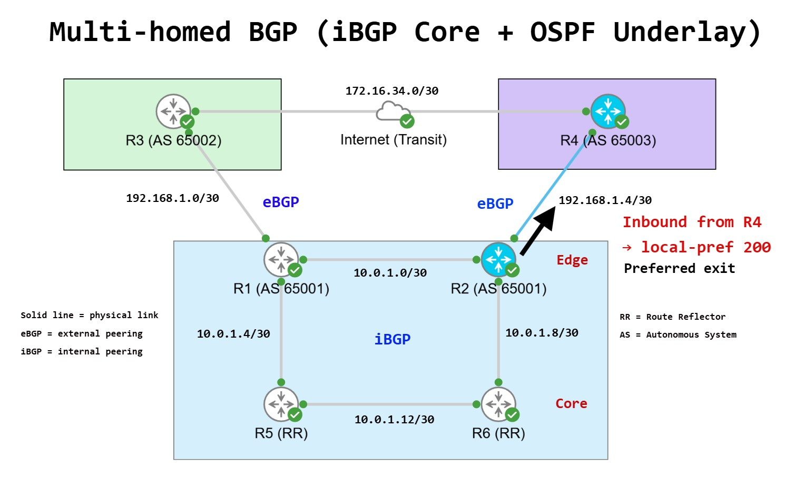

That traceroute above is cool because we can see overlay and underlay working hand-in-hand. Traceroute command using overlay IPs and output showing underlay physical interface IPs. 

<br>
<br>

***************************************************************************************

# Scenario 3) After all the changes to edge router R2 - now we'll instead simulate a full hardware failure on R2 - completely offline. 

Question:

Does my policy on R2 and R6 break traffic or gracefully fall back?

We'll also run these commands on R6 to watch changes and reconvergence:
```
terminal monitor
debug ip bgp

traceroute 1.1.1.3 source 1.1.1.6
```

*welp, we broke it. Let's figure out why*

Right away we see the word "inaccessible"

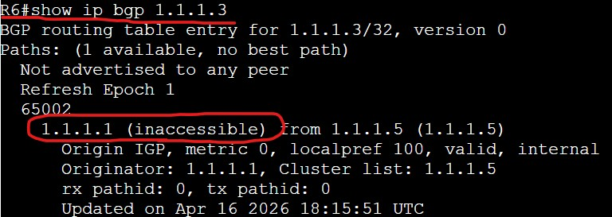

I expected BGP to fall back to R6 > R5 > R1 > R3 but it didn't. 

iBGP did converge
<br>R6 has a path from R5 (so RR is working)
<br>But BGP refuses to install it
<br>because the next-hop is not usable

That’s why we see "1 available, no best path”

iBGP does NOT change next-hop by default

So what happened:

R1 learned route from R3

R1 advertised into iBGP with:

next-hop = 1.1.1.1
R5 reflected it unchanged

R6 receives it and says: “I’ll use next-hop 1.1.1.1”

After R2 dies:
<br>R6 must now reach 1.1.1.1 (R1 loopback) via OSPF
<br>We do have a route…
<br>BUT BGP still marks it:
<br>inaccessible

Meaning:
<br>R6 cannot resolve a valid forwarding path to that next-hop

Right now:
<br>BGP convergence is fine
<br>Forwarding recursion is broken

Put another way, R2 wasn’t just “another path” -- it was helping our IGP topology. Why can't OSPF underlay reconverge as well and move the packet from R6 > R5 > R1? 

OSPF did reconverge -- What broke is BGP’s recursive next-hop resolution to a forwardable adjacent neighbor.

Conclusion: Our iBGP baseline configuration was missing 2 crucial commands in order for BGP to have resiliency during an edge failure.

Reflectors do NOT modify the next-hop

We configured edges correctly, except when R2 died, the R6 next-hop dependency to (R1) 1.1.1.1 became fragile and BGP marked it 'inaccessible' because we didn't have these next-hop-self commands between R1 and R2.

R2 at the edge failed completely and BGP was not able to failover successfully. This was a design mistake on my part. Let's break it down and fix it. 

What we need:

R1
```
router bg 65001
neighbor 1.1.1.2 next-hop-self
```
R2
```
router bg 65001
neighbor 1.1.1.1 next-hop-self
```

We add command to both R1 and R2, because we want BGP to work if the mirrored-version of the event happens with R1 failing. Whether R1 or R2 fails, we want resiliency.

With R2 down, traceroute still gets out to R3 and back:

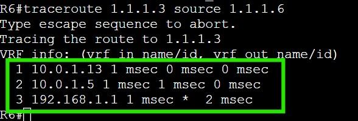

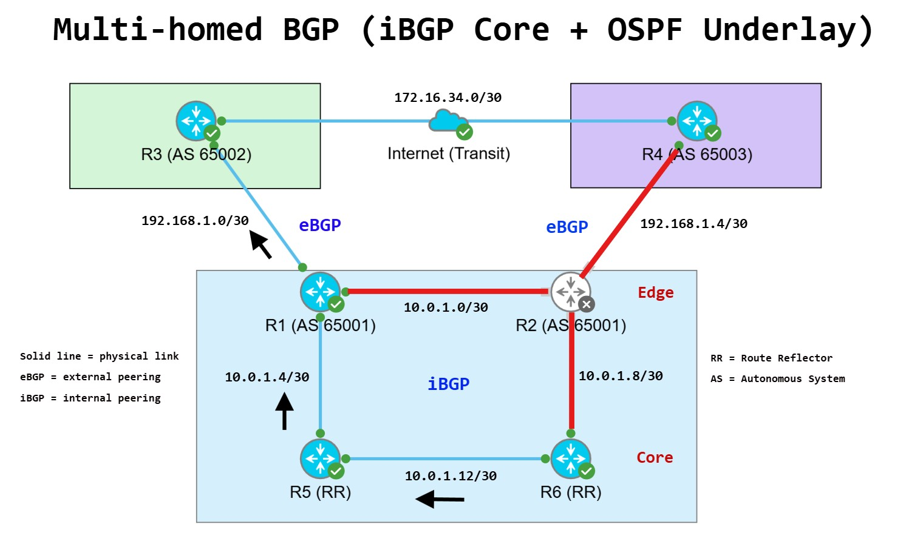

<br>
<br>

***************************************************************************************

## Final Results

- R5 and R6 successfully operated as Route Reflectors, removing the need for a full-mesh iBGP design while maintaining full route propagation across the AS.

- Advertising all 10.0.1.x internal networks into iBGP enabled external eBGP neighbors to learn return paths, enabling end-to-end connectivity.

- Removing `next-hop-self` resulted in:
  - Inconsistent next-hops  
  - ECMP behavior in the underlay  
  - Non-deterministic forwarding paths  

- After applying Local Preference changes on R6 and R2, outbound traffic from AS 65001 followed the intended paths. This was verified using `show ip bgp`, `show ip route`, and `traceroute`.

- Shutting down R2 (Scenario 3) exposed a hidden iBGP dependency that only appeared during failure, impacting path usability until design corrections were applied.

- The final topology successfully demonstrated multi-homing, controlled path selection, and stable internal route propagation.

<br>

## Key Takeaways

- Gained a deeper understanding of why iBGP is required in larger networks, beyond simple default gateway routing, and the value it provides for internal route propagation.

- Learned how OSPF can function as an underlay while iBGP operates as an overlay, and how these layers interact to provide end-to-end connectivity.

- Understood the behavioral differences between iBGP and eBGP, particularly in route advertisement and next-hop handling.

- Observed how Route Reflectors (R5 and R6) eliminate the need for full-mesh iBGP, improving scalability (in larger environments) while maintaining route distribution.

- Explored next-hop resolution between the underlay (OSPF) and overlay (iBGP), and how misalignment between the two can break forwarding.

- Reinforced that BGP selects the best path, but the IGP determines how to reach the next-hop.

- Learned that Local Preference can be used to influence outbound traffic patterns

- Discovered that route propagation issues are often tied to next-hop reachability and iBGP design, not just missing advertisements.

- Observed that troubleshooting with `ping` becomes more nuanced in layered designs, as source IP selection impacts results. Using the `source` option is critical for accurate testing.

- Gained a clearer understanding of how underlay and overlay separation introduces additional complexity compared to flat network designs.


