# OSPF Multi-Area Design, Cost Tuning & Backbone Failure

Lab was built using VMware Workstation with Cisco Modeling Labs v2.8.1 

<br>


<br>

# Overview:

<br>

Designed and validated an OSPF (Open Shortest Path First) topology. Introduced scenarios such as path selection, cost manipulation, stub areas, backbone failure, and troubleshooting scenarios.

<br>

# Objectives:

<br>

- Design and implement a multi-router OSPF topology

- Configure OSPF adjacencies across multiple network segments

- Analyze OSPF neighbor relationships

- Manipulate OSPF path selection using interface cost

- Validate routing decisions using show ip route and traceroute

- Troubleshoot OSPF issues including missing routes and suboptimal paths

- Demonstrate understanding of route preference (connected, static, OSPF)

- Implement loopback interfaces to simulate reachable network destinations

<br>

# Scenarios: 

1) Stub Area Conversion 

2) OSPF Cost Manipulation 

3) Backbone Link Failure

<br>

# Topology:

<br>


# Baseline Configurations:

Initial commands entered into all routers in topology:
```
enable secret cisco
hostname {}
no ip domain lookup

line console 0
logging synchronous
exec-timeout 0 0
password cisco
login

line vty 0 4
logging synchronous
exec-timeout 15 0
password cisco
login
transport input ssh

copy running-config startup-config 
```

# VLAN & Interface Configuration:

IP scheme -- leave the fourth IPv4 octet simple by continuing to use the 
.1 and .2 addresses in the 'zero subnet' of each network. 

We use the third octet for differentiating networks

Example: R1 connects to R2 - so the network is 10.0.12.0/30. See below:

```
R1  to R2    10.0.12.0/30
R1   E0/0    10.0.12.1
R2   E0/0    10.0.12.2

R1  to R3    10.0.13.0/30
R1   E0/1    10.0.13.1
R3   E0/0    10.0.13.2

R2  to R3    10.0.23.0/30
R2   E0/1    10.0.23.1
R3   E0/1    10.0.23.2

R3  to R5    10.0.35.0/30
R3   E0/2    10.0.35.1
R5   E0/0    10.0.35.2

R2  to R4    10.0.24.0/30
R2   E0/2    10.0.24.1
R4   E0/0    10.0.24.2

R4  to R6    10.0.46.0/30
R4   E0/1    10.0.46.1
R6   E0/0    10.0.46.2

R5  to R7    10.0.57.0/30
R5   E0/1    10.0.57.1
R7   E0/0    10.0.57.2
```

<br>

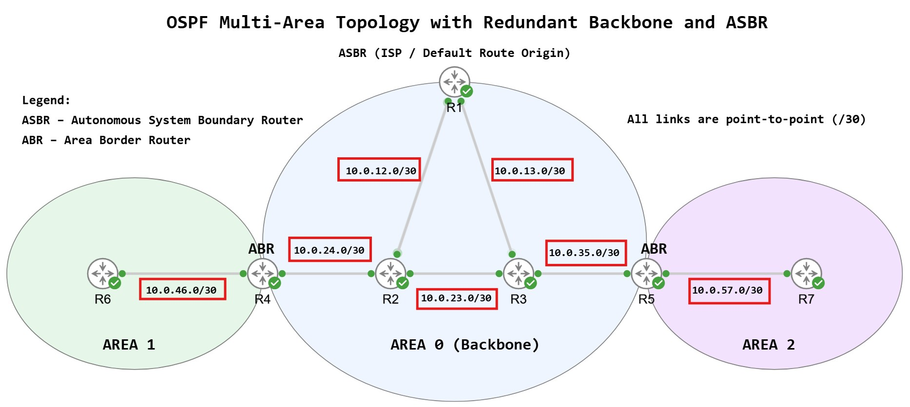


Descriptions on router interfaces:

Example: 
```
interface e0/0
description Link to R2 (10.0.12.0/30)
```

<br>

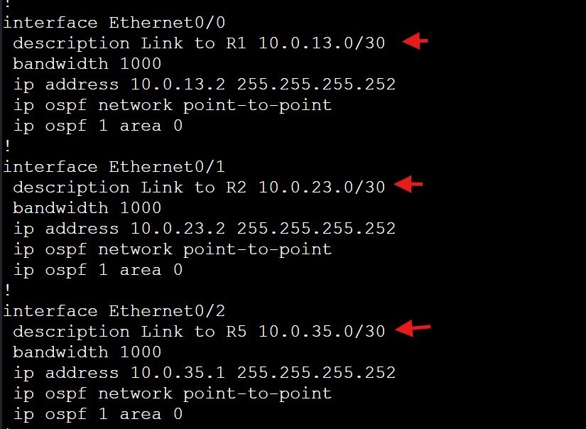

<br>

# R1
```
configure terminal
ip route 0.0.0.0 0.0.0.0 <fake-ISP-next-hop>
router ospf 1
default-information originate  (simulates "Internet exists outside the OSPF domain")
```
<br>


<br>

*Because this multi-area OSPF lab is using only /30 point-to-point OSPF link type, there will be NO DR or BDR election process.

## The manual loopback configuration overrides any automatic choosing of router ID value.

All routers are running OSPF process-ID 1 for simplicity - though OSPF process-IDs are only 
locally significant and can be different. 

Configured two methods for good measure:

R1 1.1.1.1
```
interface loopback0
ip address 1.1.1.1 255.255.255.255

router ospf 1
router-id 1.1.1.1
```
*Repeat above for R2-7*

If needed, we can use this command to reset OSPF process on a router:
<br>clear ip ospf process

<br>

## Question: Why use loopback for Router ID?

- They are always up

- Provide stability

- Prevent RID changes during link failures

- Manual router-id = control

- Loopback = stability

- Using both = clean engineering practice

<br>

A `0.0.255.255` wildcard mask is used to enable OSPF process 1 on all interfaces matching the first two octets of the IPv4 address.

For practice, the equivalent OSPF area is also configured directly under interface configuration mode.

For ABRs, OSPF is configured per interface only (without wildcard statements), since they participate in multiple areas.

## Command applied to all non-ABR routers in the topology:

```
router ospf 1
network 10.0.0.0 0.0.255.255 area {x}
```

<br>

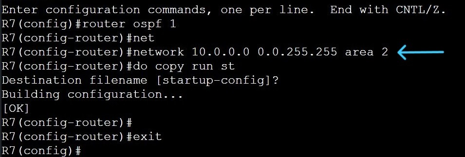

<br>

ABR R4:
<br>E0/0 area 0
<br>E0/1 area 1

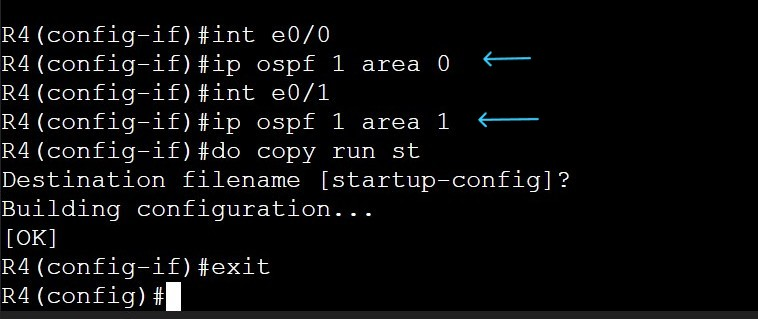

<br>

ABR R5:
<br>E0/0 area 0
<br>E0/1 area 2

<br>

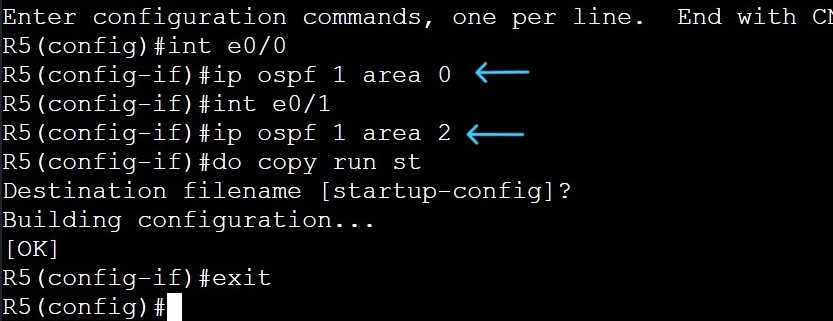

<br>

R4(config-if)#ip ospf 1 area 0
<br>% OSPF will not operate on this interface until IP is configured on it.
<br>*whoops*

<br>

I've also read it is good practice to make loopback interfaces passive so we're inputing this command in all 7 routers:

R1-7
```
router ospf 1
passive-interface loopback0
```
<br>

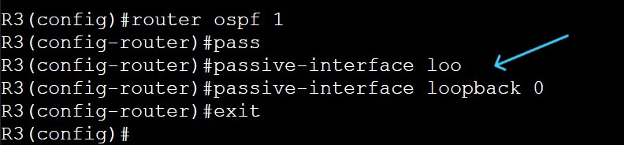

<br>

We're also tuning the interfaces for 1000 Bandwidth for realism and OSPF calculations. Example:

R2(config)#
```
int range e0/0-3
bandwidth 1000
exit
```
<br>

******************************************************************************************

<br>

Area Border Routers (ABRs) advertise routes between OSPF areas, allowing Area 1 and Area 3 to exchange reachability information. This includes propagation of the default route originated by R1 (ASBR) through OSPF. 

## Useful debugging and log commands from EXEC mode:

Logging and OSPF updates: `terminal monitor`

Enables debug output over SSH/console: `debug ip ospf events`

Hello Packets (great for mismatches): `debug ip ospf hello`

Neighbor Adjacency Issues. Adjacency formation steps & state changes (INIT → FULL): `debug ip ospf adj`

This command will turn debugging OFF. Debugs can also eat CPU: `undebug all`

<br>

************************************************************************************

This is a point-to-point design, so we need to change the OSPF to PTP on all interfaces
instead of broadcast type. Right now we can see the routers are electing DRs and BDRs:

<br>

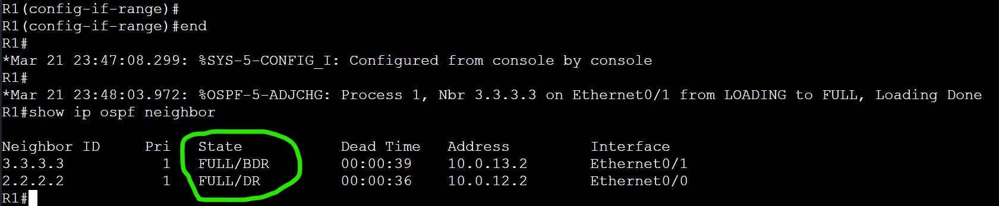

<br>

Solution:
```
interface range e0/0-3
ip ospf network point-to-point
```

<br>

We can see a level 4 warning: *Mar 22 00:04:02.084: %OSPF-4-NET_TYPE_MISMATCH: Received Hello from 3.3.3.3 on Ethernet0/1 indicating a  potential network type mismatch - because I'm changing one router at a time. 

<br>

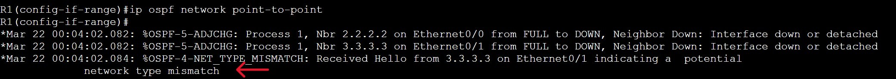

<br>

Because the election process and adjacent neighbor relationships have been formed, to reset OSPF process use:
```
clear ip ospf process
```

<br>


<br>

***************************************************************************************

<br>

We want to make sure topology is configured correctly before initiating break scenarios:

Goal: The network is fully converged, correctly designed, and routing properly. Baseline.

<br>

We will use:
```
show ip ospf neighbor
show ip route
show ip ospf interface brief
show ip ospf database
ping
traceroute
show ip route | include 0.0.0.0
```

To verify:

Neighbor adjacency
<br>Routing table
<br>Interface/area validation
<br>Verify LSDB
<br>Connectivity tests
<br>

# OSPF Baseline

## Neighbors:

<br>


<br>


<br>

## *Unexpected troubleshooting steps*

## 1st configuration mistake:

This is why we verify. All my routers were missing a routing entry for
Area 2 - 10.0.57.0/30. No router had OSPF routes listed for that network.

Checked both R5 (Area 0 and 2) & R7 (Area 2) and OSPF was configured correctly.

Checked connectivity... Typo. I accidently gave them both .2 last octet ip address. Resolved. Ping successful to confirm.

<br>

## 2nd configuration mistake:

Typo on OSPF manual interface area configuration. R5's E0/1 was entered as Area 1. It should be Area 2. 

<br>


<br>

Resolved. All neighbors and routes verified.

<br>


<br>

## Area Validation:

Using show ip ospf interface brief on R4 to verify OSPF areas as an example.

<br>

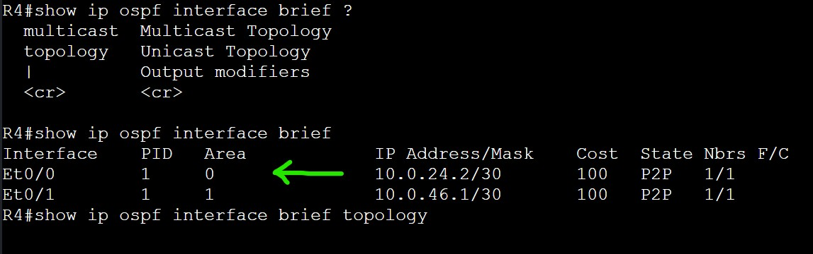

<br>

## Verify LSDB:

<br>

Router IDs 6.6.6.6 and 7.7.7.7 are not present in R3’s LSDB. This is because OSPF routers maintain detailed LSAs (Type 1 and Type 2) only for routers within the same area. Inter-area routes are summarized instead, which improves scalability and prevents the LSDB from becoming excessively large. 

Verifying Link State Database on R3:

<br>


<br>

## Connectivity Tests:

Confirming Layer 3 Connectivity:

<br>

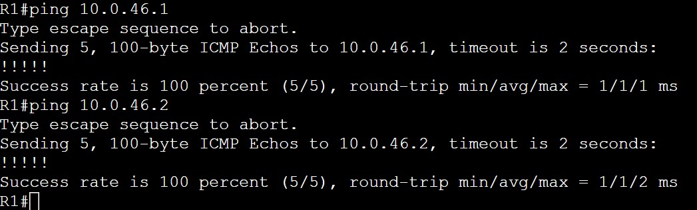

<br>


<br>

***************************************************************************************

<br>

# Scenario 1) Stub Area Conversion (Area 2)

<br>

## Convert Area 2 into a stub area and observe how:

LSA propagation changes

Routing tables simplify

Default routing behavior appears

A stub area is: An OSPF area that blocks certain LSAs to reduce overhead, and instead uses a default route to reach the rest of the network.

- Convert Area 2 into a stub area and observe how:
<br>LSA propagation changes
<br>Routing tables simplify
<br>Default routing behavior appears

Action:
```
router ospf 1
area 2 stub
```
Result:

We only configured stub on R7 - which led to adjacency down.

<br>


<br>

Resulting in R7 losing all OSPF learned routes and no connectivity outside its LAN. 

<br>

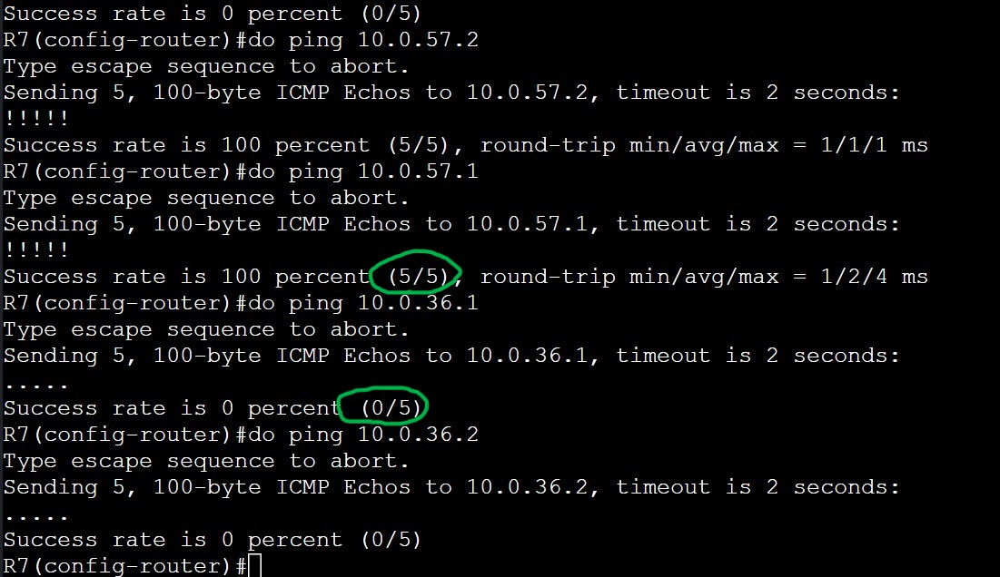

<br>

Solution:

Configure stub on R5 for Area 2. Now Area 2 is a stub.

R7 regains neighbor adjacency FULL with R5. R5 now shares all OSPF routes with R7.

R7 routing table full again. Connectivity restored. 


## Further Learning:

Why adjacency broke (the real reason)

- OSPF neighbors must agree on area characteristics during hello exchange, including stub. Mismatches:
<br>Area ID mismatch 
<br>Authentication mismatch 
<br>Stub flag mismatch 

All cause adjacency failure

<br>

***************************************************************************************

<br>

# Scenario 2) OSPF Cost Manipulation (Path Control)

<br>

We want to manipulate path R6 (Area 1) sends packets to R1 (ASBR)

All links being equal, the packet will take natural path of R6 > R4 > R2 > R1

<br>


<br>


<br>

## Cost Manipulation: 

- This was an unexpected troubleshooting issue, but part of the learning process. I attempted to adjust OSPF costs on R1 and R2 to influence path selection, but the route did not change.

- The reason: R2’s path to R1 via E0/0 is a directly connected route, which takes precedence over OSPF-learned routes. As a result, OSPF cost adjustments had no impact on the forwarding decision.

## Solution: Change the target IP address to continue planned scenario. R6 traceroute to R7.

Before: R6 > R4 > R2 > R3 > R5 > R7

<br>

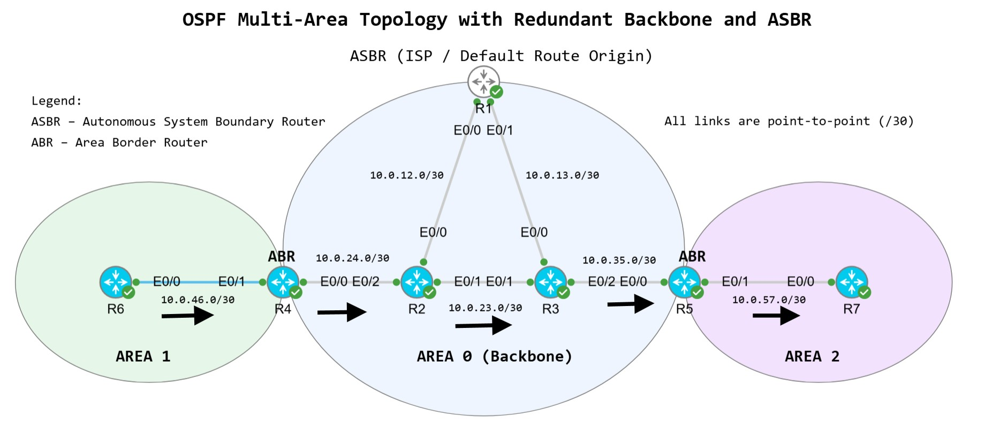

<br>

R2(config)#
```
int e0/1  
ip ospf cost 500
exit
```

<br>

Observed Behavior:

Manipulating a higher (worse) cost on the link from R2 > R3 resulted in
a different path from R6 to R7 as expected. Verified with traceroute:

<br>


<br>

After: R6 > R4 > R2 > R1 > R3 > R5 > R7

<br>

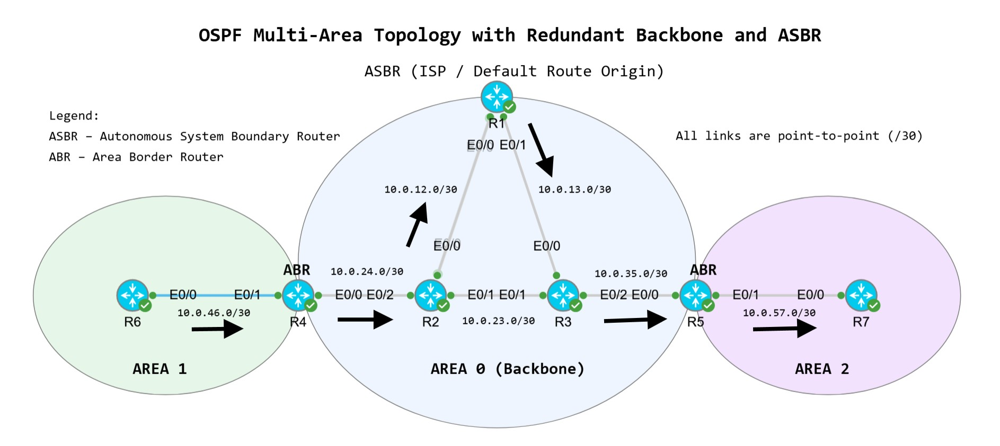

<br>

***************************************************************************************

<br>

# Scenario 3) Backbone Link Failure (R1-R3)

<br>

We will shutdown link from R1 (ASBR) to R3 (backbone router) to simulate a failure.

<br>

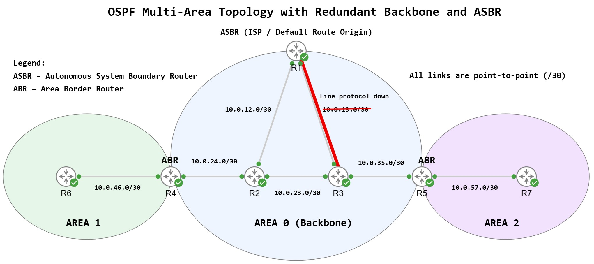

<br>

Observe changes in routing tables after OSPF reconverges. 

Determine if R3 is currently receiving OSPF Hello messages from 1.1.1.1 (R1) on E0/0.

<br>

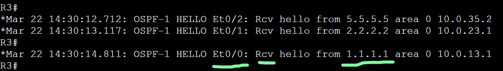

<br>

R3 Routing Table Before:

R3 has two routes available to reach 10.0.12.0/30 network. 

<br>

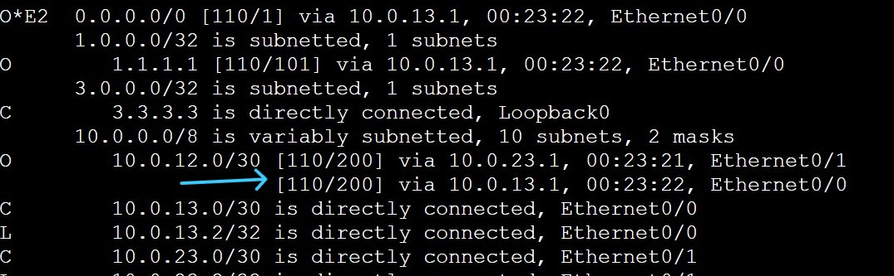

<br>

Action on R1:
```
interface e0/1
shutdown
```

Once the link between R1 and R3 failed, R3 stopped receiving hello messages from `1.1.1.1` on it's E0/0 interface.

<br>

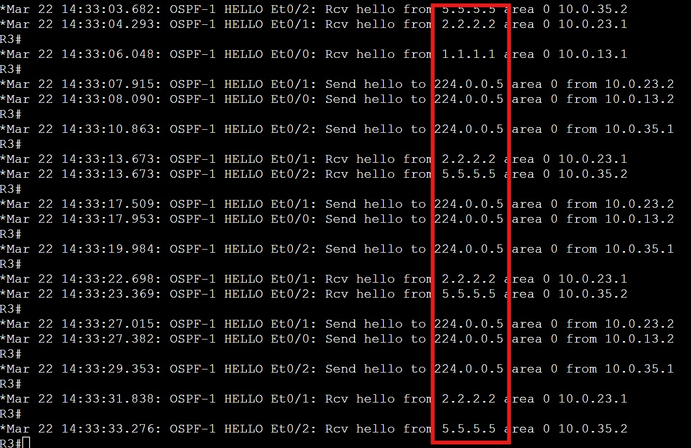

<br>

R3 Routing Table After:

R3's routing table now only has a single route to reach network `10.0.12.0/30` through R2. One route failed, but the backbone still had another route to reach the ASBR.

<br>

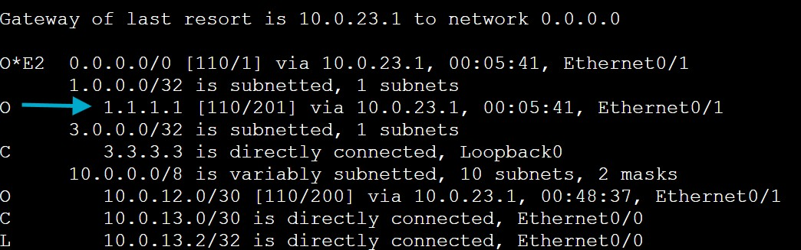

<br>

***************************************************************************************

<br>


# Key Takeaways:

- Verified OSPF convergence and failover behavior during link failure scenarios.

- OSPF stub Areas must be configured on both ends of the link on each router. 

- Connected routes may/will override OSPF interface cost manipulation. 

- Learned more about multi-area OSPF design and what information edge Areas need in order to exchange 
OSPF LSAs. 

- Learned more about LSDB and why some OSPF router information is stored, whilst some is not. As by design. 

- Troubleshooting requires validating both the control plane (LSDB) and data plane (routing table).

- We can turn on debug commands to see real-time logs. We can use this key information to help discover root cause or monitor protocol behavior.

<br>

*********************************************************************************************

<br>


