# OSPF Multi-Area Design, Cost Tuning & Failover Lab

Lab was built using VMware Workstation with Cisco Modeling Labs v2.8.1 

All switches and/or routers in this lab are running IOS XE images

 
 

 
 
 

# Overview:

 

Designed and validated an OSPF topology, focusing on path selection, cost manipulation, Stub Areas, and real-world troubleshooting scenarios.

 
 
 

# Objectives:

 

Design and implement a multi-router OSPF topology

Configure OSPF adjacencies across multiple network segments

Analyze OSPF neighbor relationships and LSDB behavior

Manipulate OSPF path selection using interface cost

Validate routing decisions using show ip route and traceroute

Troubleshoot OSPF issues including missing routes and suboptimal paths

Demonstrate understanding of route preference (connected, static, OSPF)

Implement loopback interfaces to simulate reachable network destinations

 

# Testing Scenarios: 

## Scenario 1) Stub Area Conversion 

## Scenario 2) OSPF Cost Manipulation 

## Scenario 3) Failover

 
 
 

# Topology:

 
 

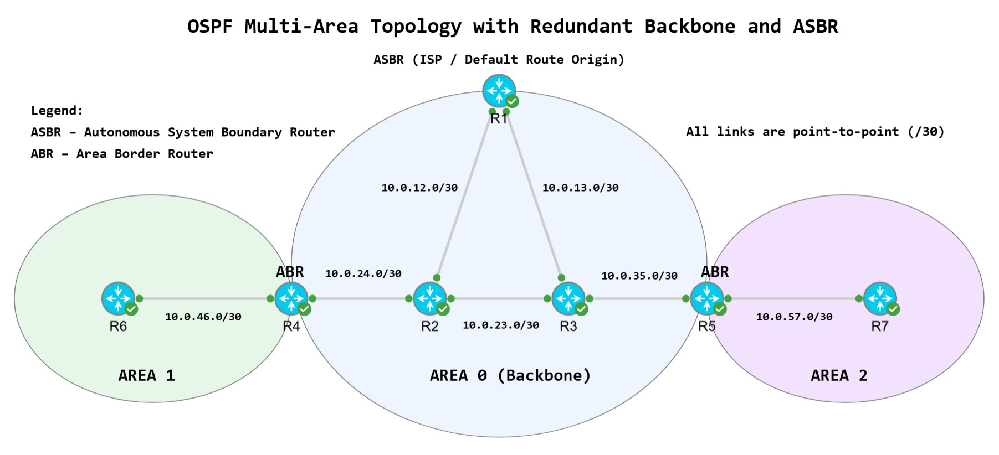

 
 
 

# Topology Description:

This lab implements a multi-area OSPF design with a redundant backbone (Area 0), two edge areas (Area 1 and Area 2), and an ASBR providing external connectivity via a default route.

The topology consists of seven routers (R1–R7) organized hierarchically to demonstrate inter-area routing, ABR behavior, and OSPF scalability principles. IOS XE. 

 
 
 

# VLAN & Interface Configuration:

 
 
 

We're using a clever IP scheme that I read about (for labbing). Leave the fourth IPv4 octet simple by continuing to use the 
.1 and .2 addresses in the 'zero subnet' of each network. 

We use the third octet for differentiating networks and the numbers correlate to router pairs.

 
 

Example: R1 connects to R2 - so the network is 10.0.12.0/30. See below:

 

R1 > R2  10.0.12.0/30

   R1  E0/0  10.0.12.1
   R2  E0/0  10.0.12.2

R1 > R3  10.0.13.0/30

   R1  E0/1  10.0.13.1
   R3  E0/0  10.0.13.2

R2 > R3 → 10.0.23.0/30

   R2  E0/1  10.0.23.1
   R3  E0/1  10.0.23.2

R3 > R5 → 10.0.35.0/30

   R3  E0/2   10.0.35.1
   R5  E0/0   10.0.35.2

R2 > R4 → 10.0.24.0/30

   R2  E0/2   10.0.24.1
   R4  E0/0   10.0.24.2

R4 > R6 → 10.0.46.0/30

   R4  E0/1   10.0.46.1
   R6  E0/0   10.0.46.2

R5 > R7 → 10.0.57.0/30

   R5  E0/1   10.0.57.1
   R7  E0/0   10.0.57.2
 
 

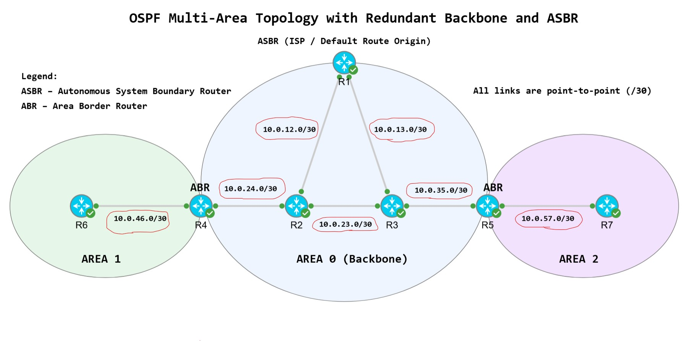

 
 
 

We've added descriptions on all configured router interfaces in the topology.

Example: 

 interface e0/0
 description Link to R2 (10.0.12.0/30)

 
 

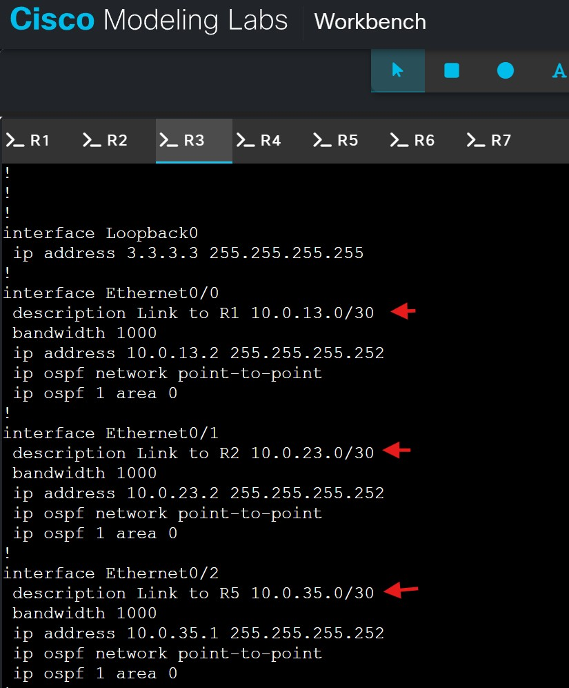

 
 
 

# R1

configure terminal

ip route 0.0.0.0 0.0.0.0 <fake-ISP-next-hop>

router ospf 1

default-information originate  (simulates "Internet exists outside the OSPF domain")

 
 

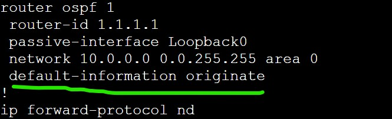

 
 
 

*Because this multi-area OSPF lab is using only /30 point-to-point OSPF link type, there will be NO DR or BDR election process.

 
 
 

# Baseline Configurations:

Initial commands entered into all routers in topology:

 enable secret cisco
 hostname {}
 no ip domain lookup

 line console 0
 logging synchronous
 exec-timeout 0 0
 password cisco
 login

 line vty 0 4
 logging synchronous
 exec-timeout 15 0
 password cisco
 login
 transport input ssh

 copy running-config startup-config 

 
 
 

## The manual loopback configuration overrides any automatic choosing of router ID value.

All routers are running OSPF process-ID 1 for simplicity - though OSPF process-IDs are only 
locally significant and can be different and still work fine if a 

Configured two methods for good measure:

R1 1.1.1.1

 interface loopback0
 ip address 1.1.1.1 255.255.255.255

 router ospf 1
 router-id 1.1.1.1

R2 2.2.2.2 

 interface loopback0
 ip address 2.2.2.2  255.255.255.255

 router ospf 1
 router-id 2.2.2.2 

R3 3.3.3.3

 interface loopback0
 ip address 3.3.3.3 255.255.255.255

 router ospf 1
 router-id 3.3.3.3

R4 4.4.4.4

 interface loopback0
 ip address 4.4.4.4 255.255.255.255

 router ospf 1
 router-id 4.4.4.4

R5 5.5.5.5

 interface loopback0
 ip address 5.5.5.5 255.255.255.255

 router ospf 1
 router-id 5.5.5.5

R6 6.6.6.6 

 interface loopback0
 ip address 6.6.6.6 255.255.255.255

 router ospf 1
 router-id 6.6.6.6

R7 7.7.7.7

 interface loopback0
 ip address 7.7.7.7 255.255.255.255

 router ospf 1
 router-id 7.7.7.7

If needed, we can use this command to reset OSPF process on a router:

clear ip ospf process

 
 

## Question: Why use loopback for Router ID?

They are always up

Provide stability

Prevent RID changes during link failures

Manual router-id = control

Loopback = stability

Using both = clean engineering practice

 
 

Wildcard choice for this OSPF lab: We're using 0.0.255.255 wildcard to apply OSPF process 1 to all interfaces that fall under the first two octets of the ipv4 address. This ensures all router interfaces involved in this topology will be part of OSPF process 1. 

(However, we're manually configuring OSPF Area on interfaces as well for practice) 

*ABRs will be configured in two OSPF areas, so I've decided to configure ABRs on interfaces only (no wildcards)*

Command applied to all non-ABR routers in the topology:

 router ospf 1
 network 10.0.0.0 0.0.255.255 area {}

 
 

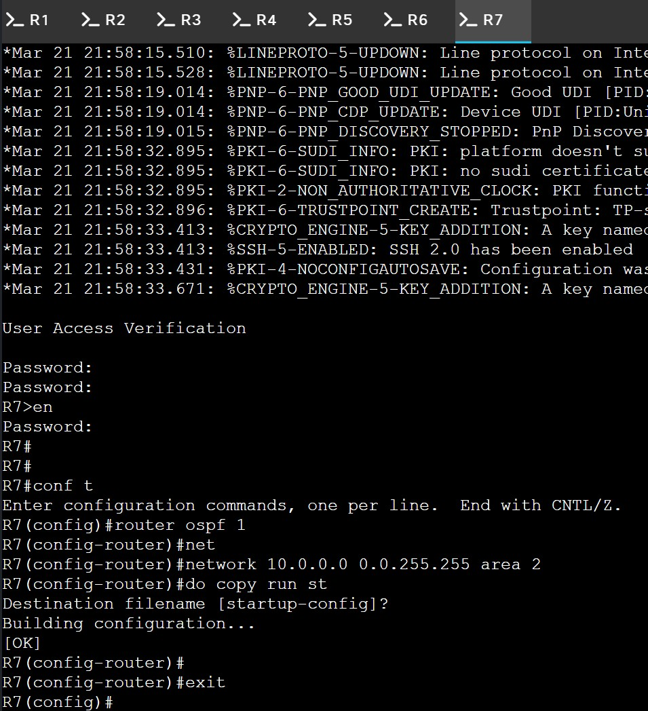

 
 

 
 
 Area 0 = R1, R2, R3
 Area 1 = R6
 Area 2 = R7
 ABRs = R4, R5
 
 

 R1   E0/0   Area 0
 R1   E0/1   Area 0

 R2   E0/0   Area 0
 R2   E0/1   Area 0
 R2   E0/2   Area 0

 R3   E0/0   Area 0
 R3   E0/1   Area 0
 R3   E0/2   Area 0

 R4   E0/0   Area 0
 R4   E0/1   Area 1

 R5   E0/0   Area 0
 R5   E0/1   Area 1

 R6   E0/0   Area 1

 R7   E0/0   Area 2
 
 

 

ABR commands per each different Area.

 
 interface {}
 ip ospf 1 area {}

 

ABR R4:

 E0/0 area 0
 E0/1 area 1

ABR R5:

 E0/0 area 0
 E0/1 area 2
 
 

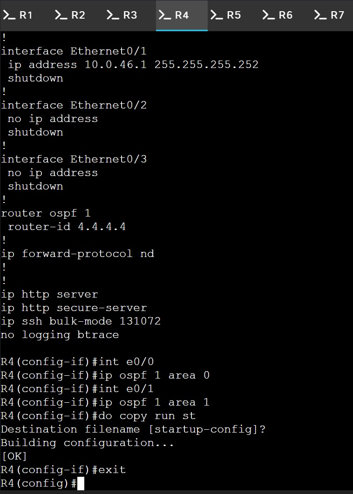 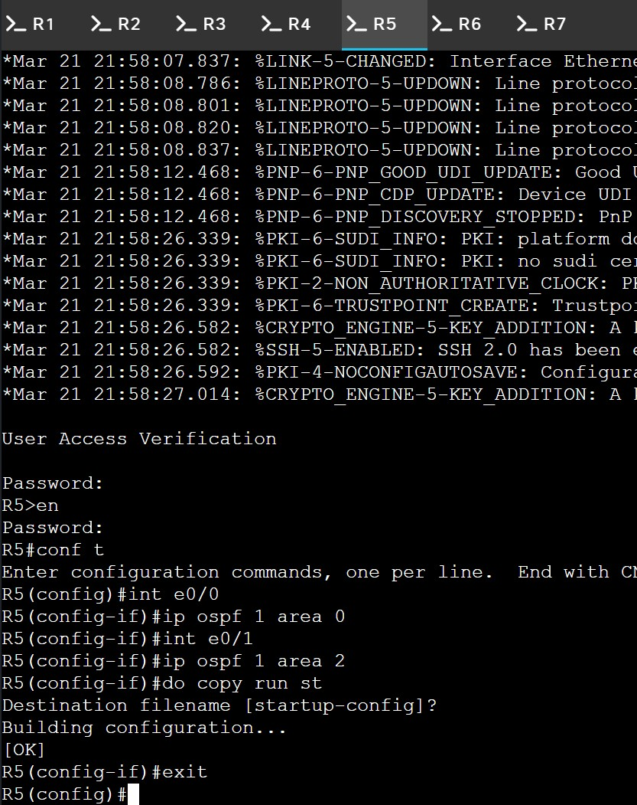

 
 

 R4(config-if)#ip ospf 1 area 0
 % OSPF will not operate on this interface until IP is configured on it.
 *whoops*

 
 
 

I've also read it is good practice to make loopback interfaces passive so I've entered this command in all 7 routers:

R1-7

 router ospf 1
 passive-interface loopback0

 
 

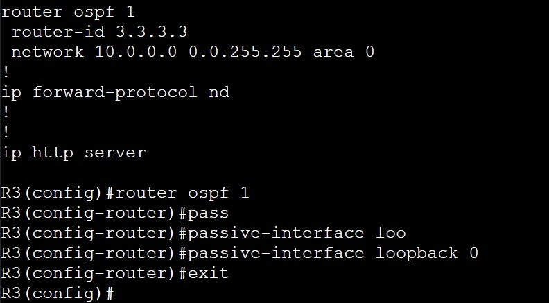

 
 

We're also tuning the interfaces for 1000 Bandwidth for realism and OSPF calculations. Example:

 R2(config)#int range e0/0-3
 R2(config-if-range)#bandwidth 1000
 R2(config-if-range)#exit
 R2(config)#

 

 
 

******************************************************************************************

 

Area Border Routers (ABRs) will translate and advertises routes between areas. This will allow Area 1 and Area 3 
to learn neighbors and the default route exiting the network from the information R1 (ASBR) provides through OSPF messages. 

Logging and OSPF updates:
 terminal monitor

Enables debug output over SSH/console
 debug ip ospf events

Hello Packets (great for mismatches)
 debug ip ospf hello

Neighbor Adjacency Issues. Adjacency formation steps & state changes (INIT → FULL):
 debug ip ospf adj 

This command will turn debugging OFF. Debugs can also eat CPU.
 undebug all

 
 

************************************************************************************

This is a point-to-point design, so we need to change the OSPF to PTP on all interfaces
instead of broadcast type. Right now we can see the routers are electing DRs and BDRs:

 
 
 

 
 
 

Solution:

 

 interface range e0/0-3
 ip ospf network point-to-point
 
 

We can see a level 4 warning: *Mar 22 00:04:02.084: %OSPF-4-NET_TYPE_MISMATCH: Received Hello from 3.3.3.3 on Ethernet0/1 indicating a  potential network type mismatch - because I'm changing one router at a time. 

 
 

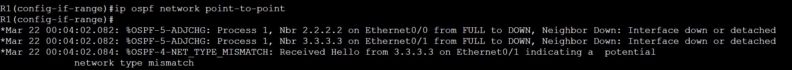

 
 

Because the election process and adjacent neighbor relationships have been formed, to quickly reset OSPF process, use:

clear ip ospf process

 
 

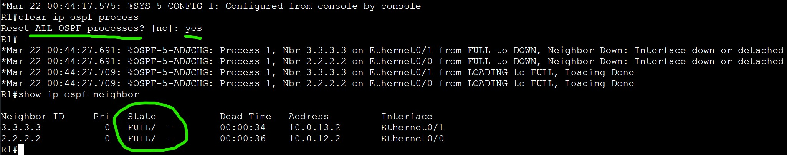

 
 

***************************************************************************************

 
 
 

We want to make sure topology is configured correctly before initiating break scenarios:

Goal: The network is fully converged, correctly designed, and routing properly. Baseline.

We will use:

 show ip ospf neighbor
 show ip route
 show ip ospf interface brief
 show ip ospf database
 ping
 traceroute
 show ip route | include 0.0.0.0

To verify:

 Neighbor adjacency
 Routing table
 Interface/area validation
 Verify LSDB
 Connectivity tests

 
 
 

# OSPF Baseline

## Neighbors:

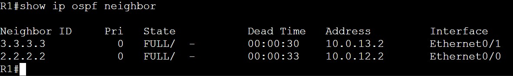

 

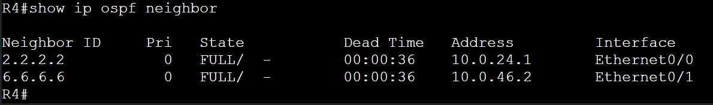

## Routes:

## *Unexpected tshooting step:

 
 

## 1st configuration mistake:

Well, this is why we verify. All my routers were missing a routing entry for
Area 2 - 10.0.57.0/30. No router had OSPF routes listed for that network.

Checked both R5 (Area 0 and 2) & R7 (Area 2) and OSPF was configured correctly.

Checked connectivity... Typo. I accidently gave them both .2 last octet ip address. Resolved. Ping successful to confirm.

 
 

## 2nd configuration mistake:

Typo on OSPF manual interface area configuration. R5's E0/1 was entered as Area 1. It should be Area 2. 

 
 

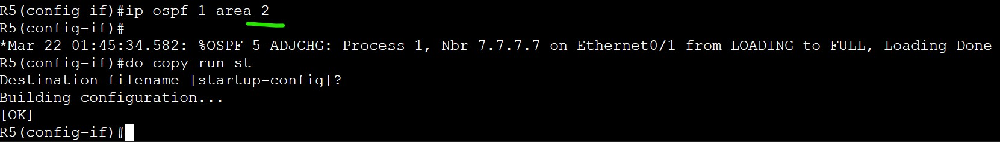

 
 

Resolved. All neighbors and routes verified.

 
 

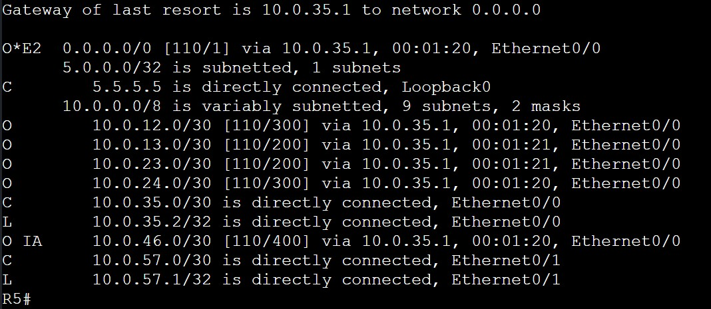

 
 
 

## Area Validation:

Using <show ip ospf interface brief> on R4 to verify OSPF areas as an example.

 
 

 
 

## Verify LSDB:

 

Interesting thing I just learned - You can't see router-IDs for 6.6.6.6 and 7.7.7.7. They are missing in R3's LSDB.
Router's don't store OSPF routers from other areas inside their own LSDB. Why?

Scalability. LSDB would be too massive in large networks. 

Verifying Link State Database on R3:

 

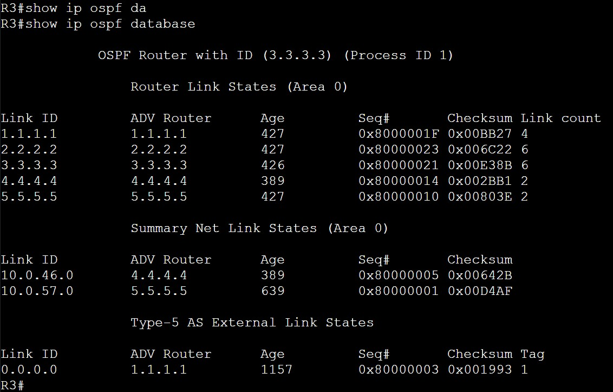

 

## Connectivity Tests:

Confirming Layer 3 Connectivity:

 
 

 
 

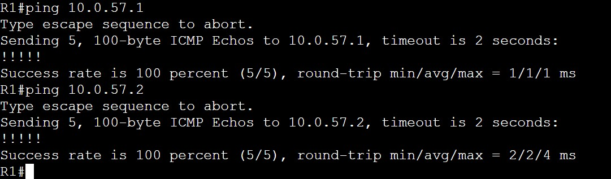

 
 

***************************************************************************************

# Scenario 1) Stub Area Conversion (Area 2)

 

## Convert Area 2 into a stub area and observe how:

LSA propagation changes

Routing tables simplify

Default routing behavior appears

A stub area is:

An OSPF area that blocks certain LSAs to reduce overhead, and instead uses a default route to reach the rest of the network.

Convert Area 2 into a stub area and observe how:

 LSA propagation changes
 Routing tables simplify
 Default routing behavior appears

Action:

 router ospf 1
   area 2 stub

Result:

We only configured stub on R7 - which led to adjacency down and link failure. 

 
 

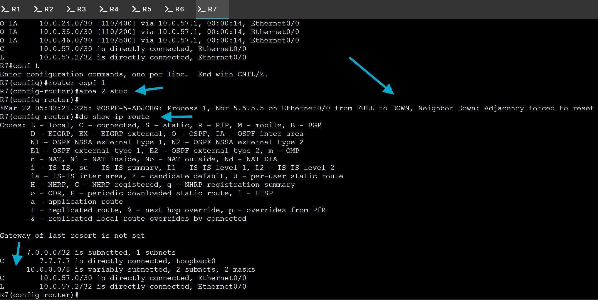

 
 

Resulting in R7 losing all OSPF learned routes and no connectivity outside its LAN. 

 
 

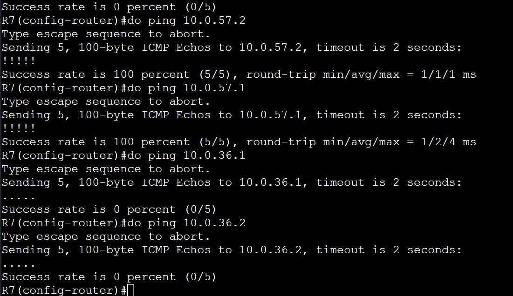

 

 

Solution:

Configure stub on R5 for Area 2. Now Area 2 is a stub.

R7 regains neighbor adjacency FULL with R5. R5 now shares all OSPF routes with R7.

R7 routing table full again. Connectivity restored. 

(returned R7 to original OSPF config)

Further Learning:

Why adjacency broke (the real reason)

OSPF neighbors must agree on area characteristics during hello exchange, including stub.

Mismatches:

 Area ID mismatch 
 Authentication mismatch 
 Stub flag mismatch 

All cause adjacency failure

***************************************************************************************

# Scenario 2) OSPF Cost Manipulation (Path Control)

We want to manipulate path R6 (Area 1) sends packets to R1 (ASBR)

All links being equal, the packet will take natural path of R6 > R4 > R2 > R1

 
 

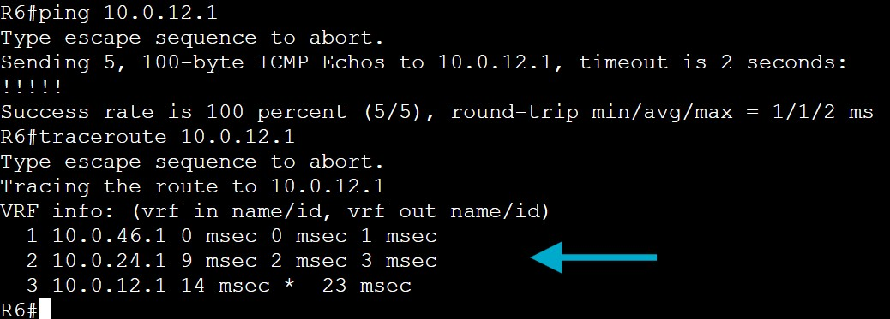

 
 

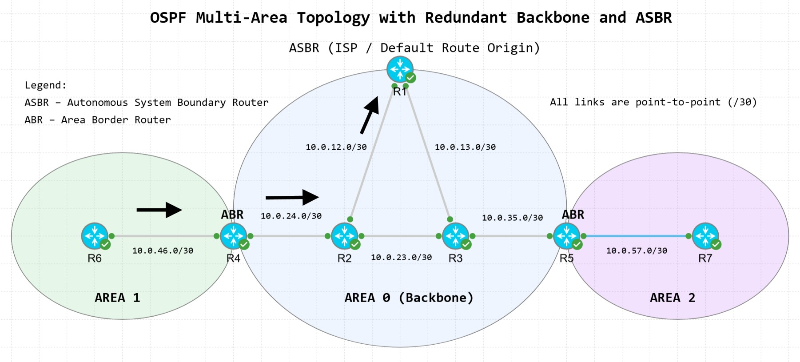

 
 
 

## Cost Manipulation: 

Well, another unexpected troubleshooting issue but that's what this entire process is about.

I tried everything to adjust OSPF costs on R2 and R1 but could not get the path to change. Something was wrong.

I finally realized R2 E0/0 > R1 is a direct connected (C) route. No OSPF cost adjustment was going to change OSPF's
decision to use E0/0.

Solution: Change the target IP address to continue scenario. R6 traceroute to R7.

Before: R6 > R4 > R2 > R3 > R5 > R7

 R6#traceroute 10.0.57.2
 Type escape sequence to abort.
 Tracing the route to 10.0.57.2
 VRF info: (vrf in name/id, vrf out name/id)
   1 10.0.46.1 1 msec 14 msec 1 msec
   2 10.0.24.1 53 msec 15 msec 3 msec
   3 10.0.23.2 25 msec 8 msec 11 msec
   4 10.0.35.2 8 msec 16 msec 6 msec
   5 10.0.57.2 4 msec *  4 msec

 
 

 
 

 R2(config)#int e0/1  
 R2(config-if)#ip ospf cost 500
 R2(config-if)#exit

 
 
 

Observed Behavior:

Manipulating a higher (worse) cost on the link from R2 > R3 resulted in
a different path from R6 to R7 as expected. Verified with traceroute:

 
 

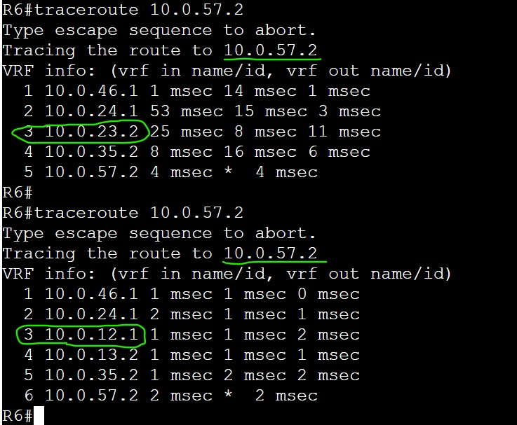

 
 

After: R6 > R4 > R2 > R1 > R3 > R5 > R7

 

 
 

***************************************************************************************
# Scenario 3) Failover

***************************************************************************************
 
 

# Key Takeaways:

 
 

Verified OSPF convergence and failover behavior during link failure scenarios

OSPF stub Areas must be configured on both ends of the link on each router. 

Connected routes may/will override OSPF interface cost manipulation. 

As my first OSPF stub configuration - I was able to see adjacency failure if only one neighbor was configured as stub.

I learned more about multi-area OSPF design and what information edge Areas need in order to exchange 
OSPF LSAs. Conceptually, it helped me go deeper into building multi area OSPF from scratch.

While configuring OSPF Areas on ABRs, I realized entering the <network 10.0.0.0 0.0.255.255 area {}> command would
cause a conflict if entered twice with two areas. Yes, I could create more specific wildcard masks for the ABRs,
but for the focus of this Lab I've decided to configure ABR OSPF areas directly on the interface.

Learned more about LSDB and why some OSPF router information is stored while some is not. Purposefully. 

OSPF path selection is based on the SPF algorithm, not just visible topology

Troubleshooting requires validating both the control plane (LSDB) and data plane (routing table)

*********************************************************************************************
 

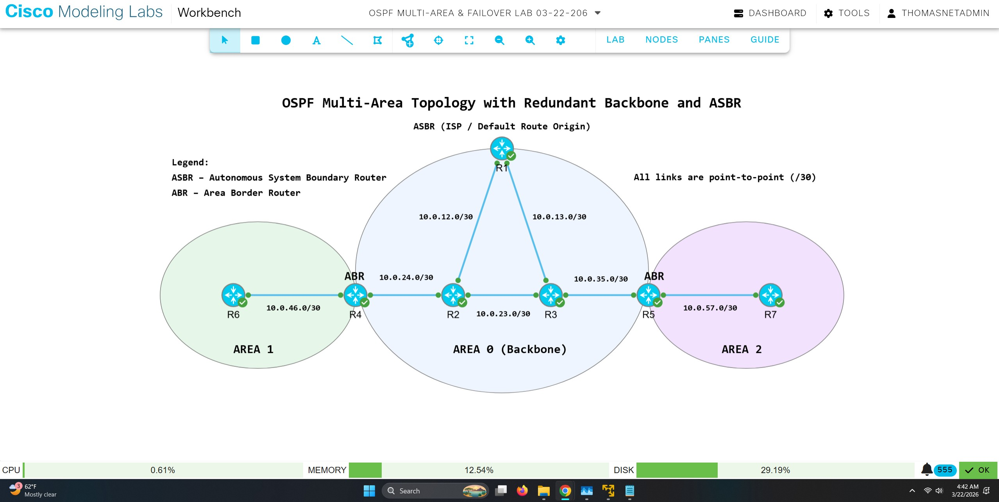

