# Redundant Campus Core Design (HSRP + EtherChannel)

Lab was built using VMware Workstation with Cisco Modeling Labs v2.8.1 

All switches routers in this lab are running IOS XE images virtualized or containered

<br>


<br>

# Topology:

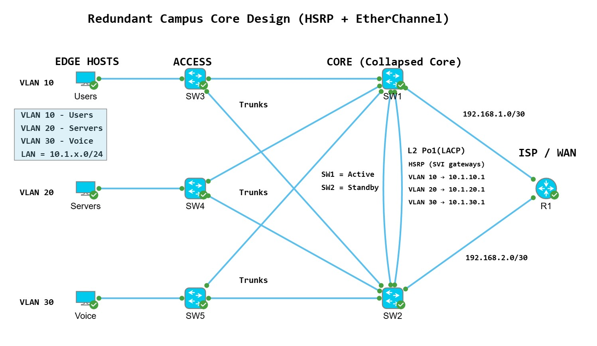
<br>

# Overview:

- This lab explores high availability and resiliency mechanisms within a switched and routed enterprise network. We introduce multiple failure and change scenarios to observe protocol behavior, topology changes and traffic flow.

- The project focuses on validating gateway redundancy through HSRP by observing behavior when a failure occurs. We also test link aggregation resilience by introducing both individual EtherChannel member link failures - and a complete port-channel outage.

- Additionally, the lab examines the impact of HSRP and STP misalignment, highlighting potential suboptimal traffic paths and the importance of proper Layer 2 and Layer 3 design coordination. 

<br>

HSRP = Hot Standby Routing Protocol
<br>VRRP & GLBP are other related options but we are not using those protocols here. Today we're using HSRP.

## In the design:

- SW1 = HSRP Active (primary gateway)
<br>SW2 = HSRP Standby (backup gateway)
<br>Hosts use virtual IP (VIP) as their default gateway
<br>SVIs provide Layer 3 routing for VLANs 

## What’s happening under the hood

- EtherChannel - gives us bandwidth + stability
<br>RSTP - decides the forwarding topology
<br>We - influence RSTP (root bridge per VLAN)
<br>HSRP - follows our design to avoid suboptimal routing

*We are not pruning any VLANs on the trunks in this lab. All trunk links in topology
will be configured to allow VLAN 10, 20, 30.  

## Objectives:

<br>

## Scenarios:

1) HSRP Active Failure (Gateway Failover)

2) EtherChannel Member Link Failure

3) Full EtherChannel Failure (Core Split Test)

4) HSRP + STP Misalignment

<br>

## Topology Description:

- This is a collapsed-core design with two multi-layer switches acting as the distribution layer and core layer 3 routing out
to R1 (simulating an ISP / WAN link)

- Each Access Layer switch: SW3, SW4, SW5 - has redundant links to the core layer 

- SW1 and SW2 are configured for HSRP for each VLAN

- EtherChannel between SW1 & SW2 is layer 2 and part of RSTP topology 

- RSTP will treat the port channel as a single layer 2 logical link. The port channel will be part of RSTP's convergence 

- Inter-VLAN routing is through SW1 & SW2 SVIs. There is no Router-on-a-stick (ROAS) in this topology 

- SW1 as Active
<br>SW2 as Standby

<br>

## VLAN & Interface Configuration:

R1 acting as WAN /ISP so we will give SW1 & SW2 a default route out of the LAN:

SW1
```
ip route 0.0.0.0 0.0.0.0 192.168.1.1 
```
SW2
```
ip route 0.0.0.0 0.0.0.0 192.168.1.2
```

On all switches (core + access) we configure the following VLANs:

vlan 10
<br>name USERS

vlan 20
<br>name SERVERS

vlan 30
<br>name VOICE

<br>

## Physical routed interfaces using IP addresses:

SW1 E0/0
```
interface e0/0
ip address 192.168.1.2 255.255.255.252
description WAN Link to ISP R1
```

SW2 E0/0
```
interface e0/0
ip address 192.168.2.2 255.255.255.252
description WAN Link to ISP R1
```

<br>R1 E0/0
```
interface e0/0
ip address 192.168.1.1 255.255.255.252
```
R1 E0/1
```
interface e0/1
ip address 192.168.2.1 255.255.255.252
```
<br>

Configuring HSRP Switched Virtual Interfaces (SVIs) on SW1 and SW2. These addresses will be default gateway for VLAN hosts.

- HSRP:
<br>Higher priority = becomes ACTIVE
<br>Lower priority = becomes STANDBY (VRRP alternatively uses Active/Passive)
<br>*{preempt} option = takes back control if it comes back online.*
<br>*Keep in mind HSRP, {priority} number = higher number is better / superior. If tied, highest IP address on that interface wins*

- VLAN 10 = 10.1.10.1
<br>VLAN 20 = 10.1.20.1
<br>VLAN 30 = 10.1.30.1

## Below:
<br>HSRP Group Number
<br>Must match per VLAN
<br>VLAN 10 = HSRP group 10 (clean + easy to debug)

*Scalability: While you can have multiple groups per VLAN, it is best practice to map one group to one VLAN to prevent management complexity.*
<br>

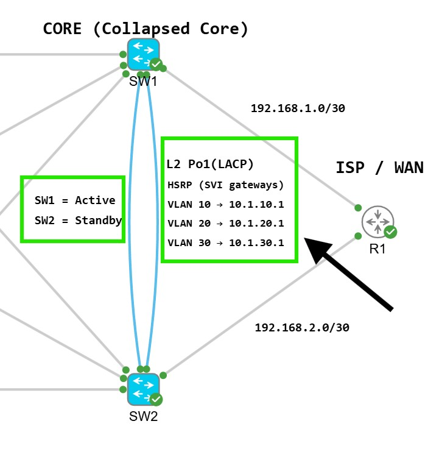

<br>

## SW1:

VLAN 10
```
interface vlan 10
ip address 10.1.10.2 255.255.255.0
standby 10 ip 10.1.10.1
standby 10 priority 110
standby 10 preempt
no shutdown
```
VLAN 20
```
interface vlan 20
ip address 10.1.20.2 255.255.255.0
standby 20 ip 10.1.20.1
standby 20 priority 110
standby 20 preempt
no shutdown
```

VLAN 30
```
interface vlan 30
ip address 10.1.30.2 255.255.255.0
standby 30 ip 10.1.30.1
standby 30 priority 110
standby 30 preempt
no shutdown
```

## SW2:

VLAN 10
```
interface vlan 10
ip address 10.1.10.2 255.255.255.0
standby 10 ip 10.1.10.1
standby 10 priority 100
standby 10 preempt
no shutdown
```

VLAN 20
```
interface vlan 20
ip address 10.1.20.2 255.255.255.0
standby 20 ip 10.1.20.1
standby 20 priority 100
standby 20 preempt
no shutdown
```

VLAN 30
```
interface vlan 30
ip address 10.1.30.2 255.255.255.0
standby 30 ip 10.1.30.1
standby 30 priority 100
standby 30 preempt
no shutdown
```

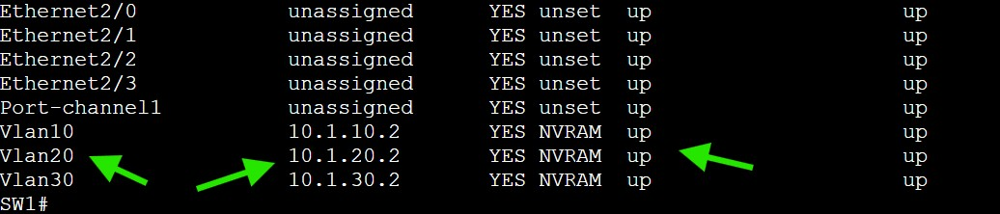

<br>

Remember, we have to issue a no shutdown on VLAN interfaces first as they are down by default. (SW1 & SW2)

<br>

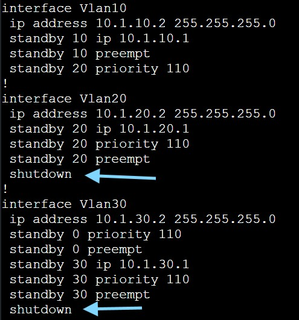

<br>

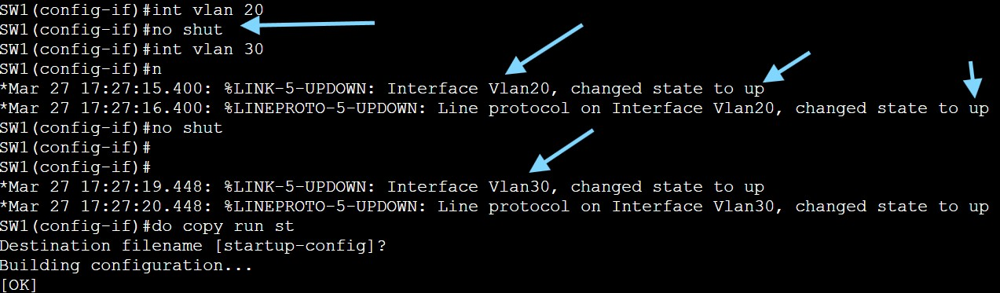

<br>

And we verify to make sure SVIs are working at layer 3:

<br>

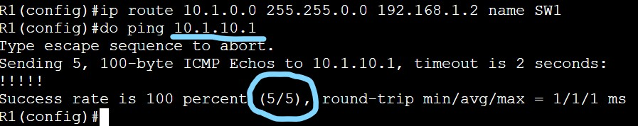

<br>

*We will keep the same core multi-layer switch as the Active role in this HSRP lab. We will save the mapping of different STP topologies to different Active / Standby switches to load balance different VLAN traffic for a future lab*

EtherChannel LACP configuration between SW1 & SW2 (two physical links logically acting as a single link)

*We are using LACP encapsulation dot1Q and we are using 'Active' negotiation for Port Channel 1 on both ends* 

SW1
```
interface range e0/1-2
switchport trunk encapsulation dot1q
switchport mode trunk
channel-group 1 mode active
interface po1
switchport trunk allowed vlan add 10,20,30
```
SW2
```
interface range e0/1-2
switchport trunk encapsulation dot1q
switchport mode trunk
channel-group 1 mode active
interface po1
switchport trunk allowed vlan add 10,20,30
```

We can use this command to confirm LACP: 
```
show lacp neighbor
```

<br>

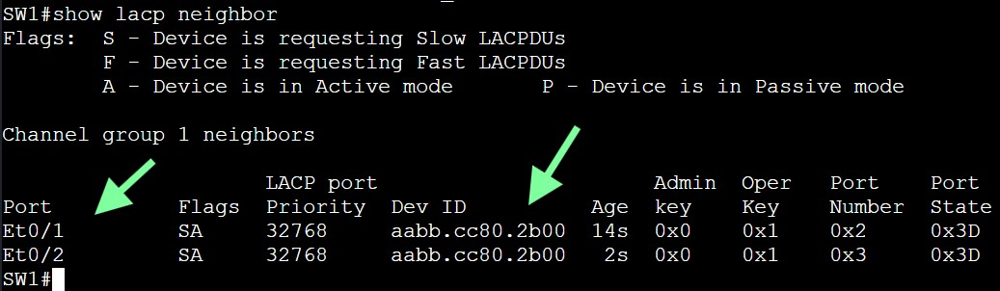

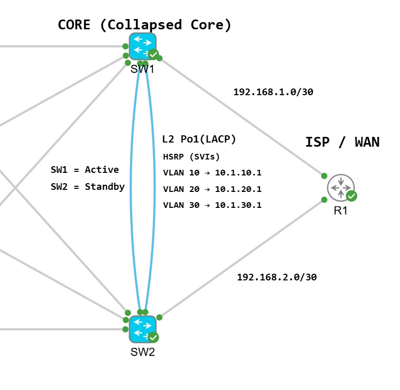

<br>

Trunk Configuration for all layer 2 ethernet links between Access layer switches and Core layer switches:
```
interface range {interfaces}
switchport trunk encapsulation dot1q
switchport mode trunk
switchport trunk allowed vlan add 10,20,30
```

<br>

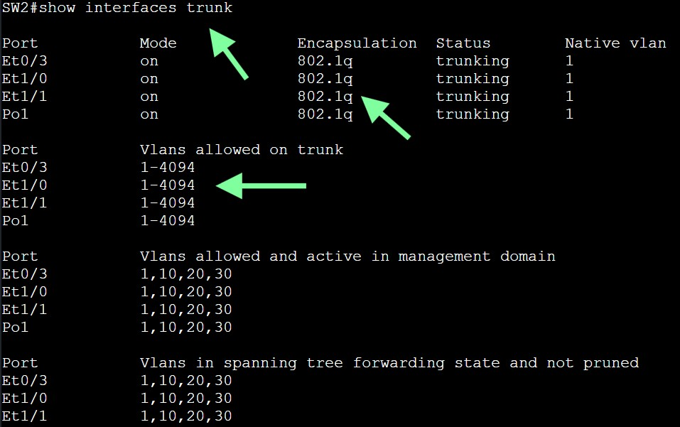

<br>

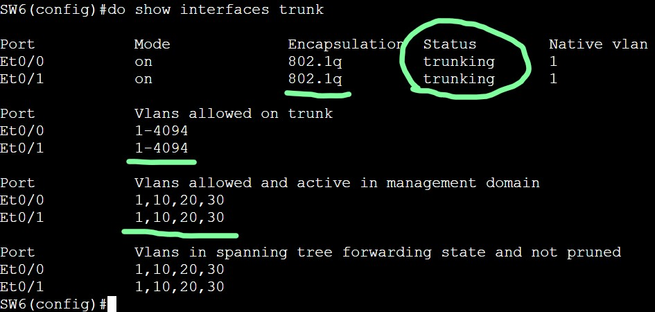

<br>

We'll verify EtherChannel on SW1 & SW2:
<br>show interfaces po1 etherchannel 
<br>

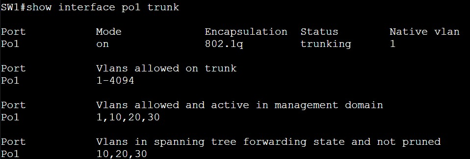

<br>

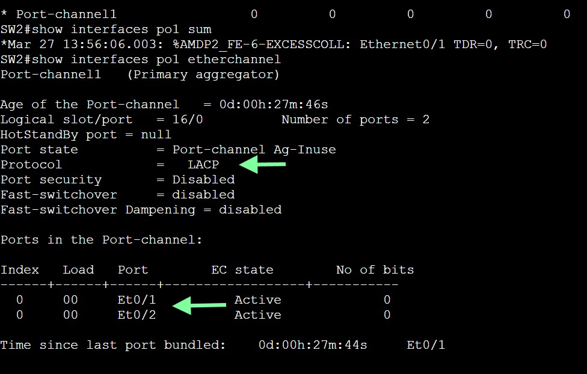

<br>

# Universal configurations:

Full baseline configurations are available in the configs/ directory

Initial IOS XE configurations I entered for all network nodes:
```
enable secret cisco
hostname {}
no ip domain lookup

line console 0
logging synchronous
exec-timeout 0 0
password cisco
login

line vty 0 4
logging synchronous
exec-timeout 15 0
password cisco
login
transport input ssh

copy running-config startup-config 
```
<br>

Apline Linux Desktop in VLAN 10,20,30 to test end-to-end connectivity and configured with:
```
sudo hostname USERS
sudo ifconfig eth0 10.1.10.99 netmask 255.255.255.0
```

*we needed to also add default gateway - see ping fail below*

```
sudo route add default gateway 10.1.10.1 eth0
```

<br>

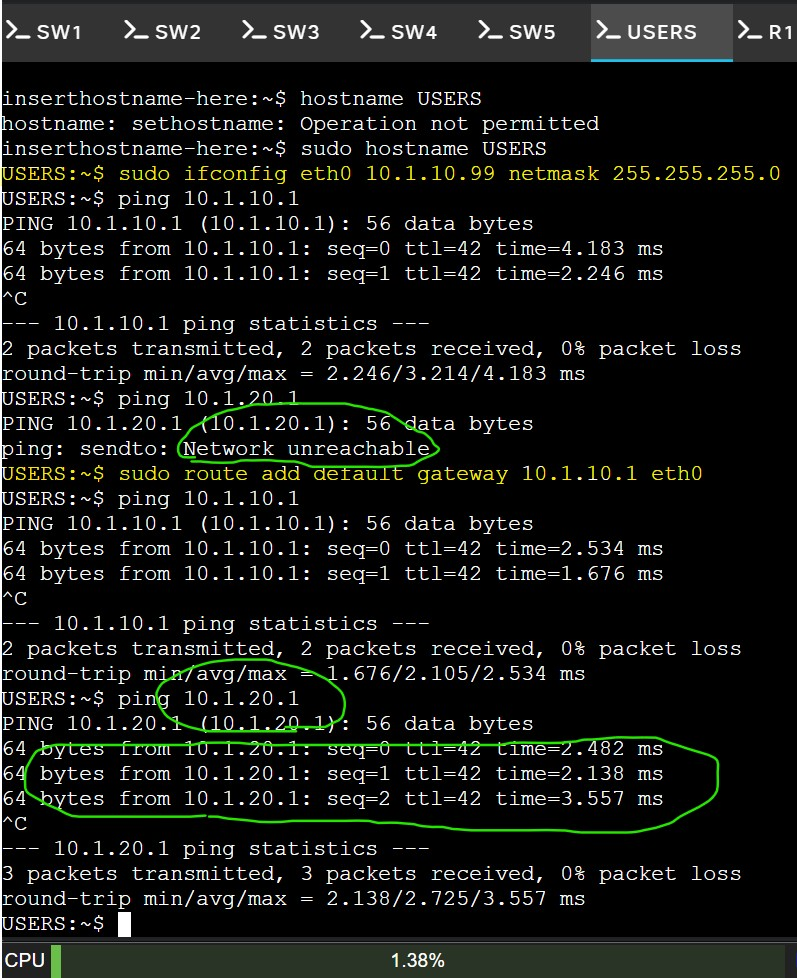

<br>

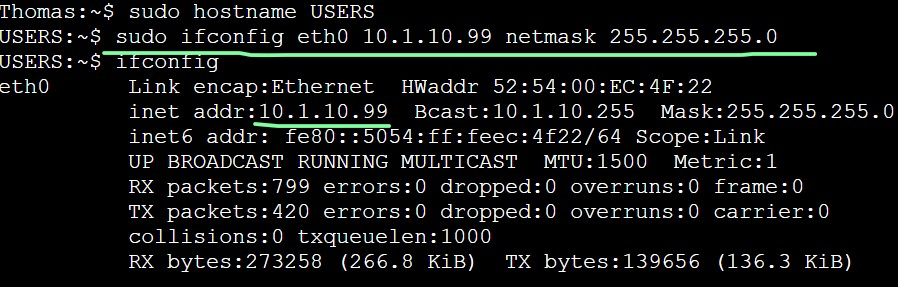

Desktop Servers & Desktop Voice will be configured the same:

Servers:
```
sudo ifconfig eth0 10.1.20.100 netmask 255.255.255.0 up
sudo route add default gw 10.1.20.1 eth0
```

Voice:
```
sudo ifconfig eth0 10.1.30.101 netmask 255.255.255.0 up
sudo route add default gw 10.1.30.1 eth0
```

In Cisco Modeling Labs, Linux desktop nodes don't persist config changes unless you manually edit config in UI using the provided shell script. 
But you can make eth0 interface changes here, so you don't have to do it every time you boot up your CML lab:

<br>

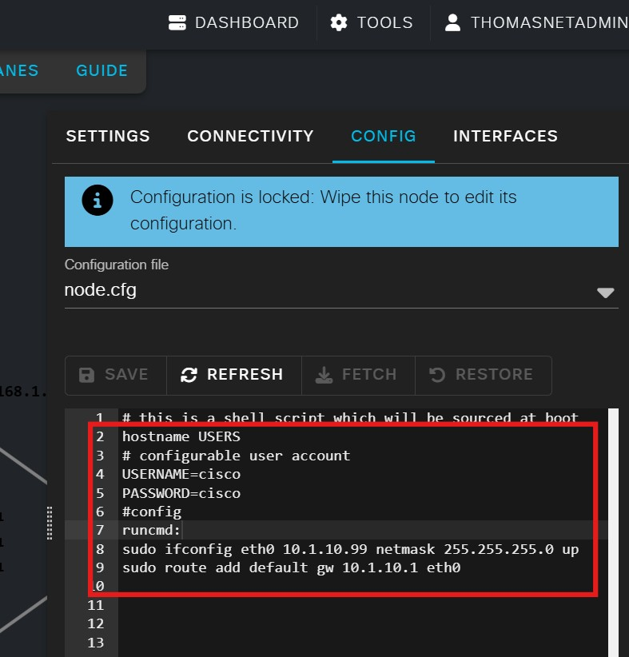


## Verifying end-to-end network connectivity through layer 2 to the core, and out layer 3 to the ISP:

*Ran into unexpected ping connectivity issues. Troubleshooting will commence!*

This is what labbing is about. I made a mistake on R1. Though R1 is not the focus of the lab,
we still want to ensure connectivity so the network design is valid and find the fix! In the design I made mistake that is related to the often termed "Asymmetric routing with HSRP." This is a little off-track from objectives but we push on to solve the problem anyway because we must. :)

<br>

HSRP on SW1/SW2
<br>Dual links from R1 to SW1 and SW2
<br>Equal-cost routes on R1

So R1 is doing load balancing, in a sense. Messing with my HSRP plans when pinging 192.168.1.1 from the desktop nodes. 

Some traffic goes to SW2 (STANDBY) ❌

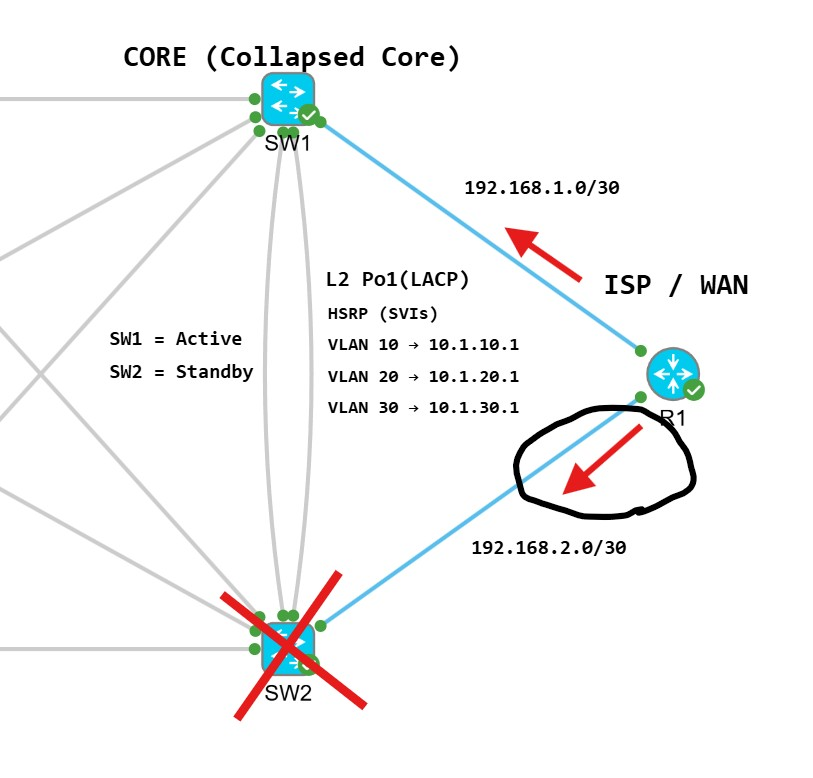

## Here’s the problem:

- SW2 is STANDBY so it does NOT own the virtual IP
<br>So it may drop or mishandle the traffic

- R1 has two choices to get to network 10.1.x.x/24
<br>nexthop 192.168.1.2  (E0/0)
<br>nexthop 192.168.2.2  (E0/1)

Routers don’t “prefer” one path unless you tell them to.

## Rule
<br>HSRP + multiple upstream paths = must control routing symmetry

# This is one way to resolve this topology design issue with R1 acting as a dual-homed ISP:

<br>

For lab purposes, we simply tell R1 not to use 192.168.2.2 for any destination network 

```
no ip route 10.1.0.0 255.255.0.0 192.168.2.2
```

## What does this command do?

Remove the static route that exactly matches this destination + mask + next-hop from the running configuration.

The router:

Removed that line from running-config
<br>Recalculated routing table
<br>Removed that path from RIB + CEF

<br>

## R1 before:

<br>

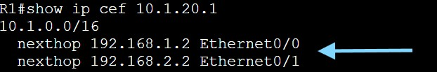
<br>

## R1 after: 

<br>

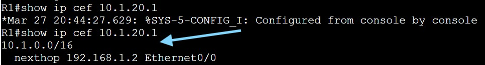

<br>

Here we can see successful pings from R1 to all three SVIs inside the LAN's core switches:

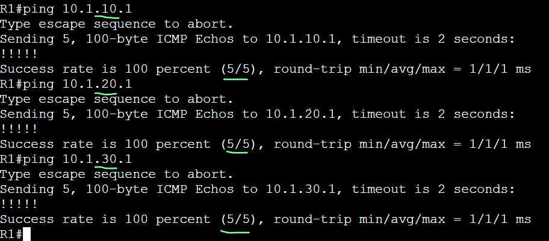

<br>

## Resolved. 

<br>

*Okay now the t-shooting of the tangential issue is complete, we can continue with break scenarios*

<br>

***************************************************************************************

<br>

# Scenario 1) HSRP Failover (SW1 down)

## Objective:

- Simulate failure of the active HSRP switch (SW1) and verify that the standby switch (SW2) takes over as the default gateway with minimal disruption.

- We will shutdown all interface VLANs 10, 20, 30 on SW1 to simulate SVI gateway IP failure. 

*Unexpected problem - when shutting down SVI gateways on SW1 root, SW2 did not become root as I planned. SW5 became the root. I have to remind myself that layer 2 RSTP and layer 3 HSRP are not directly correlated, yet can still affect one another's behavior and traffic flow. 

But for this lab design, I do want SW1 and SW2 to also be the STP roots, as well as HRSP gateways. Things not going according to plan is how we learn.

Solution: I'll manually configure RSTP priority values on SW1 & SW2 to make the topology make more sense combining RSTP and HSRP:

This is not an SVI vlan interface command, this is a global config command for spanning-tree to set priority of switch/bridge:

SW1 & SW2 respectively:
```
spanning-tree vlan 10,20,30 priority 4096
spanning-tree vlan 10,20,30 priority 8192
```
OR
```
spanning-tree vlan 10,20,30 priority primary
spanning-tree vlan 10,20,30 priority secondary
```
## Resolved:

You can see the bridge System-ID extension as 4106 (4096 + 10 for vlan number = 4106)

SW1 is now RSTP root for VLANs 10,20,30. Now we shut it down and see if SW2 correctly becomes root. 

<br>

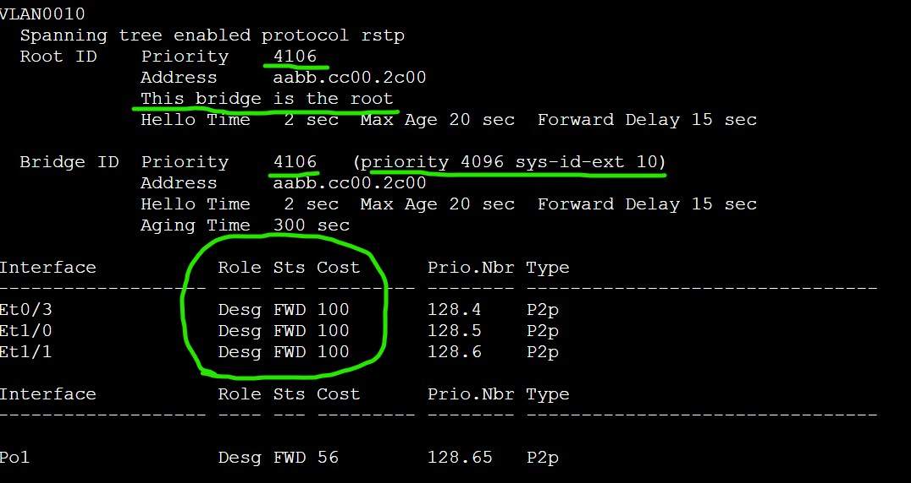

<br>

We did a shutdown on SW1 interfaces - now SW2 has become layer 2 RSTP root and layer 3 HSRP primary:

<br>

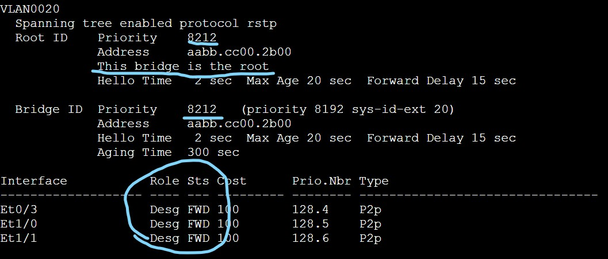

<br>

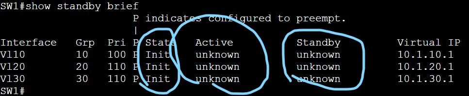

<br>

SW2 immediately takes over as default gateway - becoming 'Active' state:

<br>

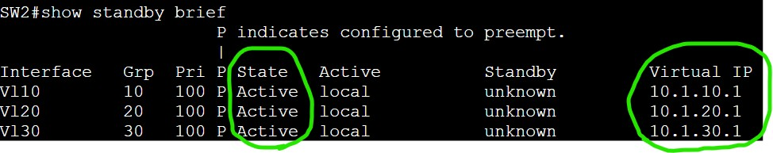

After we did a 'no shut' on both SW1's physical interfaces and a 'no shut' on the SVIs for HSRP, SW1 regained Active role. SW2 moved back to Standby role. 

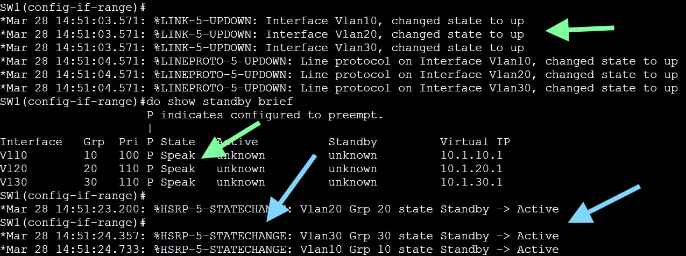

<br>

## Conclusion

- We not only concluded RSTP will recover using SW2 as root during SW1 root failure to ensure layer 2 connectivity.

- We also ensured HSRP is working when the Active gateway (SW1) fails, and the Standby gateway (SW2) takes over. 

- SW1 was down and no longer functioning as default gateway for LAN hosts. But SW2 backup ensured up-time for LAN hosts. When SW1 was up again, it regained STP root and HSRP Active.

<br>

***************************************************************************************

# Scenario 2) EtherChannel Member Link Failure
 
## Objective:

- Break a single link in the SW1 > SW2 EtherChannel / Port Channel 1:
<br>1. EtherChannel should stay up when 1 link member fails
<br>2. Bandwidth is reduced on the EtherChannel but should be no outage
<br>3. HSRP should NOT fail over

We will take down SW1's E0/2 to see what happens:

<br>

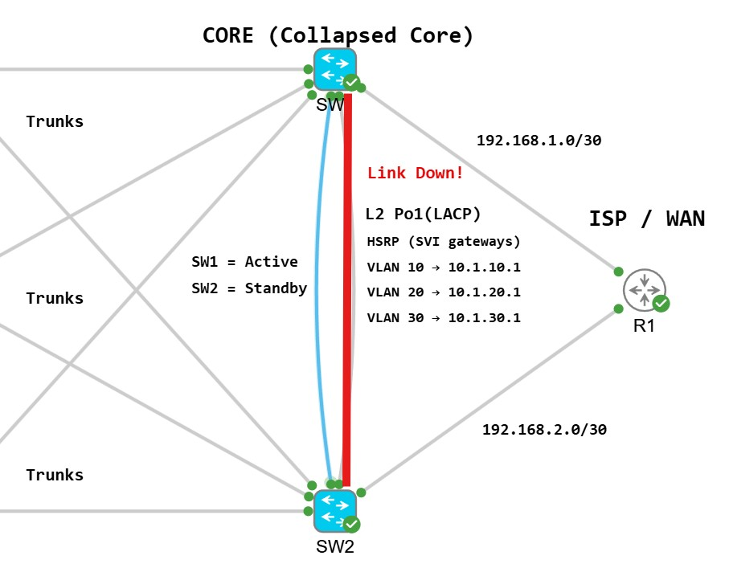

<br>

## SW1 stays up as Active HSRP gateway - we can see Po1 is up, but the second link is Et0/2(D) = down. 

The Ports column shows the physical interfaces in Po1:
<br>(P) = bundled and working
<br>(D) = down

<br>

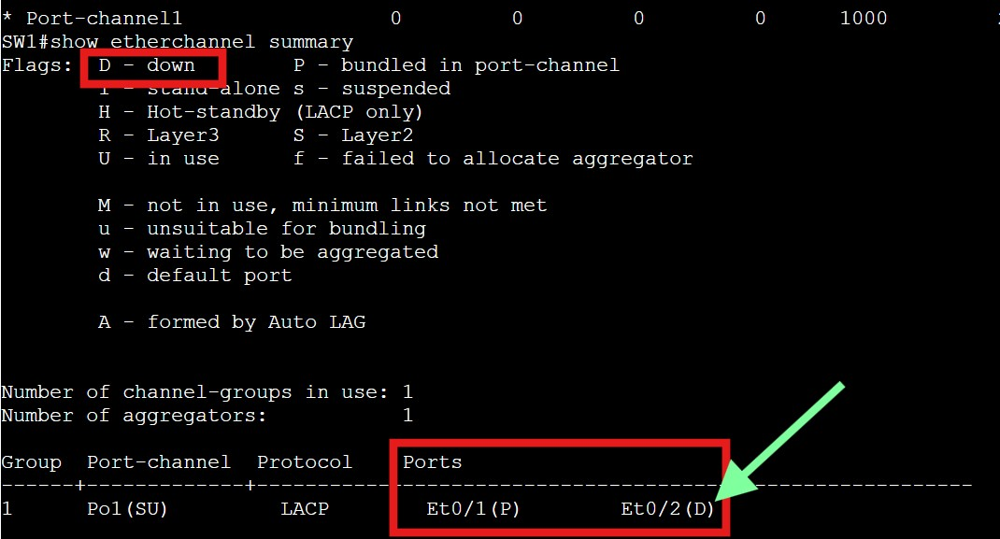

<br>

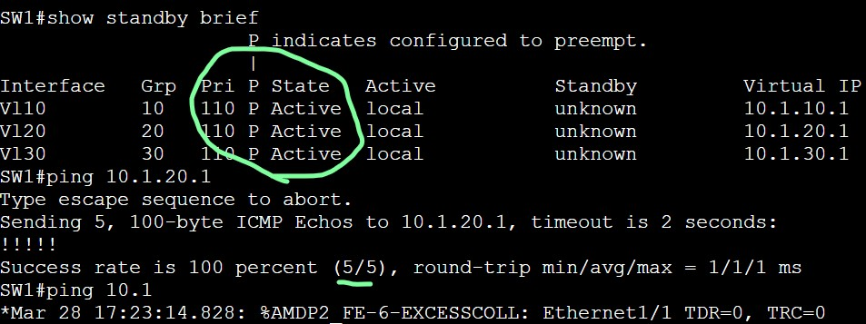

<br>

SW1 remains the root for RSTP topology, even though one link in the ether-channel failed. 

SW1 remains HSRP Active gateway as it should. 

Now we use following command on SW1 or SW2 to verify the bandwidth loss when losing a link in the ether-channel:
<br>show interface port-channel 1

BEFORE the link breaks, we can see Po1 (2x 1000 kbps links) totaling 2000 kbps bandwidth from the two links bundled together logically.
<br>

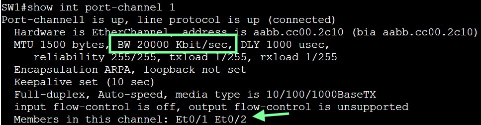

<br>

- AFTER E0/2 link fails on SW1 - we can see clearly the ether-channel is now only using one link, totaling only 1000 kbps bandwidth. Yes, we lose bandwidth, but the redundancy is success and the ether-channel stays up and operational which is what we want. 

<br>

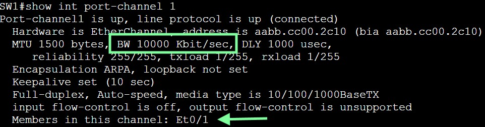

<br>

## Observed Behavior:

- The Ether-Channel stayed up successfully.

- Bandwidth is reduced on the EtherChannel but should be no outage. Success.

- HSRP did not fail over, operated as intended with no issues. 
<br>

***************************************************************************************

<br>

# Scenario 3) Full EtherChannel Failure (Core Split Test)
 
<br>

We are going to fully shutdown Po1 bundle on SW2. We are essentially splitting the core into two isolated brains.

- Expected Behavior:
<br>SW1 stays HSRP Active
<br>SW2 loses communication with SW1, so it decides to become HSRP Active as well, because it assumes SW1 is down.

*this scenario does not go according to plan...*

## From hosts connected to SW2:

- Default gateway = SW1 (HSRP Active)
<br>BUT no path to SW1 anymore ❌
<br>= BLACKHOLE

Blackhole = "A networking black hole is a location in a network where incoming or outgoing data packets are silently discarded (dropped) without notifying the source, making the data vanish. It acts as a "cyber void," causing connectivity failures, often caused by misconfigured routes, faulty hardware, or intentional "null routing" to mitigate DDoS attacks."

*we don't accomplsh a blackhole...*

## Action on SW2: 
```
interface port-channel1
shutdown
```
<br>

**************************************************************************************************

<br>

## Testing connectivity led me down a rabbit hole of SVIs and HSRP behavior, so let's dive in... 

Testing traffic pathing from end devices from Users VLAN 20, Servers VLAN 20, and Voice VLAN 30:

I was confused why I saw 10.1.10.2 from User Desktop traceroute to R1 because the HSRP gateway is 10.1.10.1:

<br>

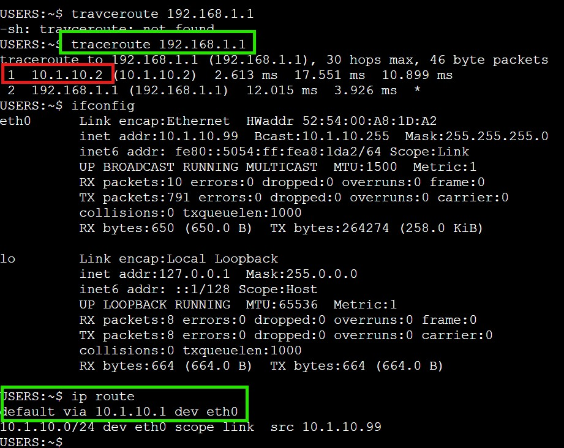

<br>

- I expected:
<br>Default gateway = 10.1.10.1 (HSRP VIP) 
<br>Traceroute hop 1 = 10.1.10.1 (this is the assumption)

- Why does traceroute use 10.1.10.2? 
<br>HSRP VIP is NOT a real interface
<br>10.1.10.1 = virtual IP

- It only exists for:
<br>ARP replies
<br>Acting as a gateway target

When the switch actually routes the packet, it uses its real SVI IP (10.1.10.2)

<br>

*****************************************************************************************************

<br>

## Before Po1 goes down:

Users, Servers, and Voice Desktops all have connectivity throughout LAN as well as to ISP/WAN outside.

<br>

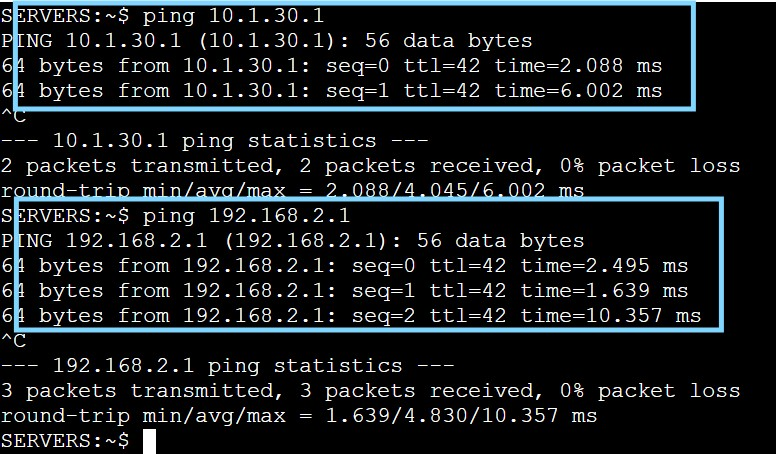

<br>

SW2 is HSRP standby state:

<br>

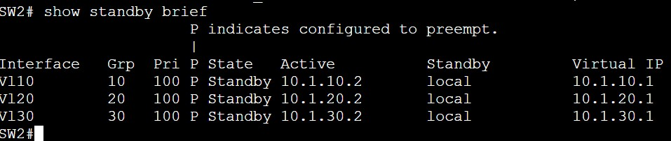

<br>

## After Po1 goes down:

SW2 immediately detects changes in the RSTP topology. 

<br>

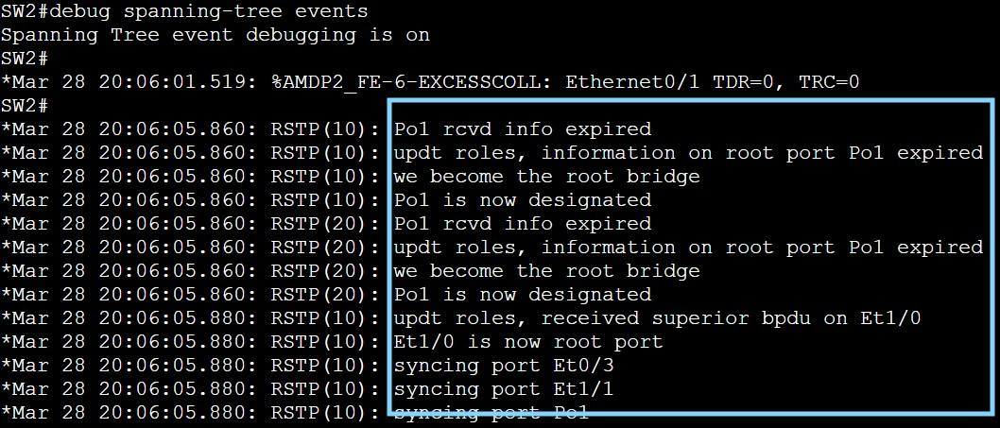

<br>

Well, SW2 did NOT become Active as I expected. This is a learning experience. Why? because other paths
exist for HSRP messages to travel between SW1 and SW2. The topology is more redundant than expect.

All VLANs and access nodes still maintained full connectivity. 

So to continue, I'll force the 'split-brain' scenario by shutting down both ends of the ether channel.

<br>

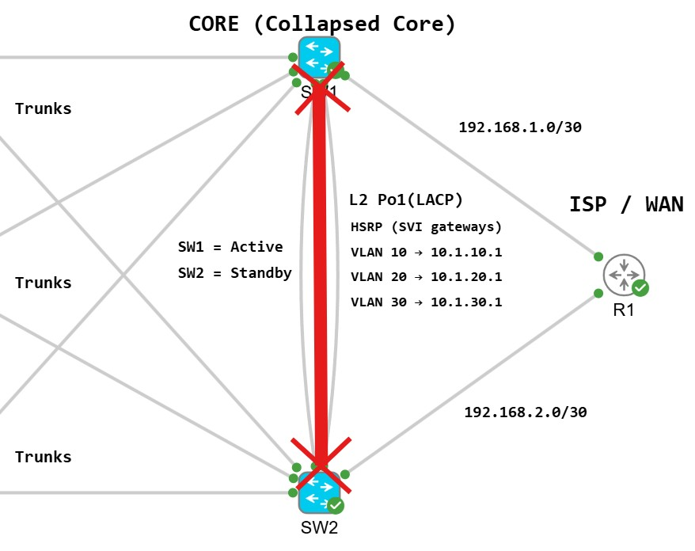

<br>

- Well, the RSTP topology changed but we still have redundancy through the LAN trunks,
so HSRP hello messages are still getting back and forth between SW1 and SW2. HSRP Active/Standby stable.

The hello messages essentially have a 'backdoor' through the LAN trunks to find the HSRP partner. 

I have to figure out what path it's taking because I'm curious at this point. The HSRP messages are making their way either
through SW5, SW4, or SW3.


Thinking about which port the switch may have sent the frame:

Root Port
<br>This is how I reach the rest of the network (upstream)

Designated Ports
<br>Connections to other segments devices (downstream)

*Just learned this - "A Cisco base MAC address is the primary, unique hardware address (often burned into the EEPROM) used to identify the switch itself, rather than a specific port. It acts as the anchor for the device, commonly utilized as the bridge ID in Spanning Tree Protocol (STP) and for generating MAC addresses for VLANs (SVIs)"*

<br>

- SW2 burned in address: aabb.cc80.2b00 - however we can't trace layer 2 that way because we are using Cisco Modeling Labs 
and virtualized nodes of the same type use the same base MAC address...

- We move on to use 'show cdp neighbors' and 'show spanning-tree vlan 10' to trace the layer 2 frames. Only Forwarding interfaces
can carry HSRP Hello messages. 

<br>

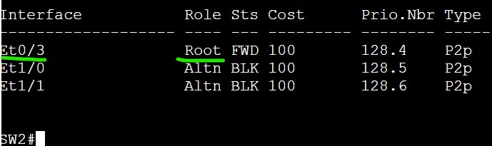

<br>

Next we see SW5 has two interfaces that can possibly forward the frame containing the hello messages from SW2:

<br>

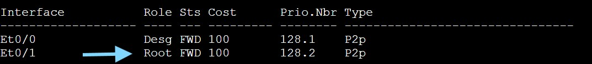

<br>

All traffic toward the rest of the network (including HSRP hellos) goes out the ROOT PORT.

Conclusion: Redundancy in the LAN trunks maintained HSRP relationship between SW1 and SW2 core layer.
We can assume all three VLANs behave this way.  

While Scenario 3 didn't turn out as expected to achieve the full HSRP 'split' that I was aiming for, we learned new lessons about HSRP hello messages and how they can traverse the topology. 

My network showed:

Redundant L2 paths via access layer 
<br>STP reconverging and keeping connectivity 
<br>HSRP hellos still flowing 
<br>No split-brain condition

<br>

***************************************************************************************

<br>

# Scenario 4) HSRP + STP Misalignment
 
First we confirm and verify starting baseline:

HSRP
<br>SW1 is active
<br>SW2 is standby

RSTP root per VLAN:
<br>VLAN 10 = SW1
<br>VLAN 20 = SW1
<br>VLAN 30 = SW1

Now we are going to break the alignment by changing SW2 to HRSP Active role, while keeping it on RSTP Standby.

SW2: We increase HSRP priority # to take over as Active role on each 3 VLANs.
```
interface vlan {x}
standby 10 priority 120
standby 20 priority 120
standby 30 priority 120
```
<br>

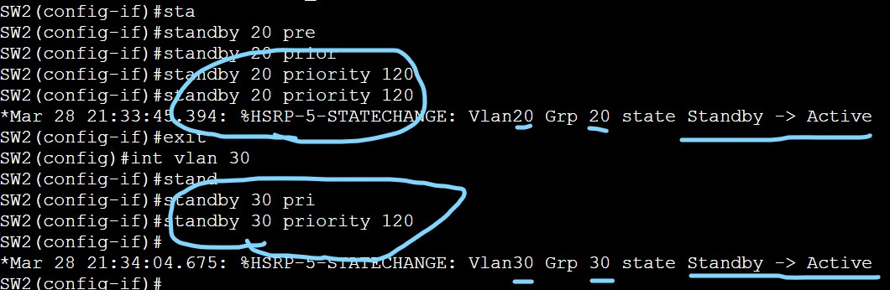

<br>

We can see the misalignment on this single screenshot of SW1:

<br>

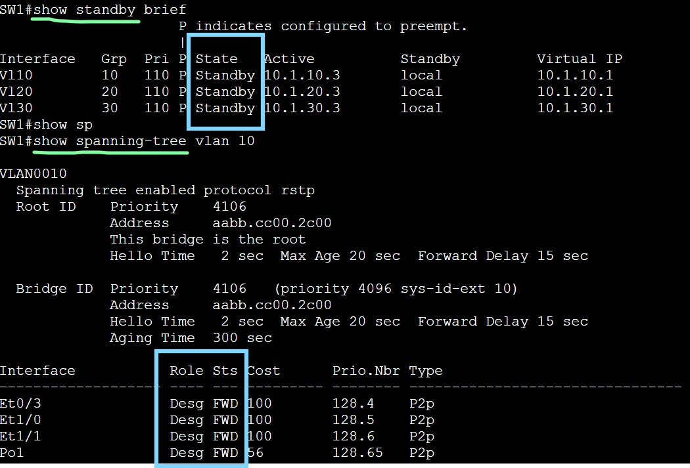

<br>

## Observed Behavior:

- Traffic goes: Access → wrong core → back across port-channel

- The inefficient traffic flow cannot be seen using traceroute because the poor traffic design
is happening at layer 2 STP before layer 3 even begins. The traffic from access layer is still
getting to it's destination due to redundancy, but we wouldn't want this happening in a production network. 

- Simply put, all access layer frame traffic flow is traversing the LAN getting sent to SW1 
because it is the STP root switch. Thus there is unnecessary layer 2 hops for the frames to be taking,
creating unneeded consumption of network utilization and processing.  

- Think of it like this...

HSRP = who answers the door
<br>STP = which road you take to get to the house

If the road leads to the wrong house first:
<br>You knock > get redirected > waste time and energy

Avoid making mistakes of misalignment - learned 

<br>

***************************************************************************************

<br>

# Final Results:

## HSRP Active Failure (Gateway Failover)

- Active HSRP switch failed
<br>Standby took over virtual IP/MAC

- Brief traffic interruption during failover
<br>MAC address moved to standby switch
<br>Network reconverged automatically

- Successful gateway redundancy
<br>Small convergence delay (depends on timers)

## EtherChannel Member Link Failure

- One physical link in the EtherChannel failed

- Port-channel remained UP
<br>Traffic redistributed across remaining links
<br>No STP recalculation triggered

- No traffic loss (or minimal)
<br>Fast convergence

## Full EtherChannel Complete Failure (Core Split Test)

- Entire Port-Channel between core switches failed

- STP reconverged
<br>Alternate paths activated
<br>Potential temporary loss depending on topology
<br>HSRP continued to work fine, by finding alternative paths for their Hello messages

- Convergence event triggered (STP)
<br>Possible transient packet loss
<br>Network remained reachable if redundant paths existed

## HSRP + STP Misalignment

- STP root ≠ HSRP active gateway

- Traffic sent to STP root first (wrong switch)
<br>Then forwarded to HSRP active switch
<br>Increased inter-switch traffic

- No outage
<br>Suboptimal traffic flow
<br>Increased latency + unnecessary hops

# Key Takeaways

- HSRP decides who is the gateway, not how traffic gets there
<br>Traffic follows Layer 2 (STP) first
<br>Then hits Layer 3 (HSRP)

- STP Controls the Real Flow. “Traffic always follows the spanning-tree topology”

- Even if:
<br>Gateway is on SW2
<br>Traffic may still go → SW1 first
<br>Alignment Is Critical

- Best Practice:
<br>STP root = HSRP active
<br>Or for even better design, align per each VLAN to allow load balancing between core nodes.

## Scenario 4 is maybe the most important lesson:

- No alerts
<br>No outages
<br>No obvious symptoms

- But:
<br>Wasted bandwidth
<br>Increased latency
<br>Hidden bottlenecks

- Traceroute Limitation:
<br>Traceroute only shows Layer 3 hops

- It cannot see:
<br>Layer 2 detours
<br>STP-driven paths
<br>Inter-switch forwarding

<br>

*********************************************************************************

<br>


