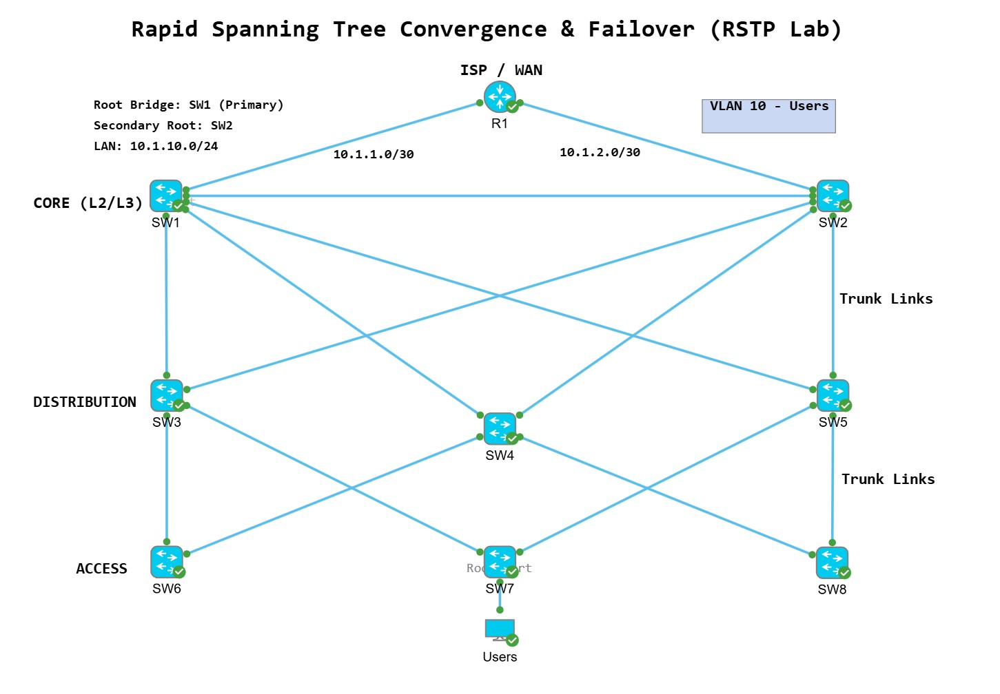
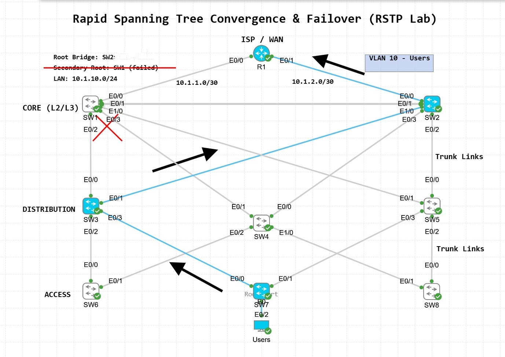
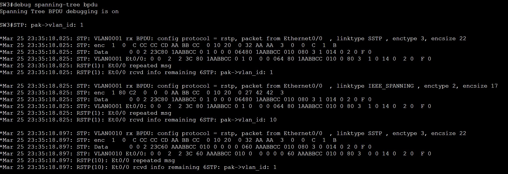
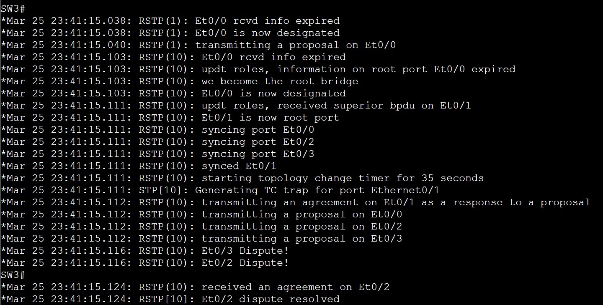
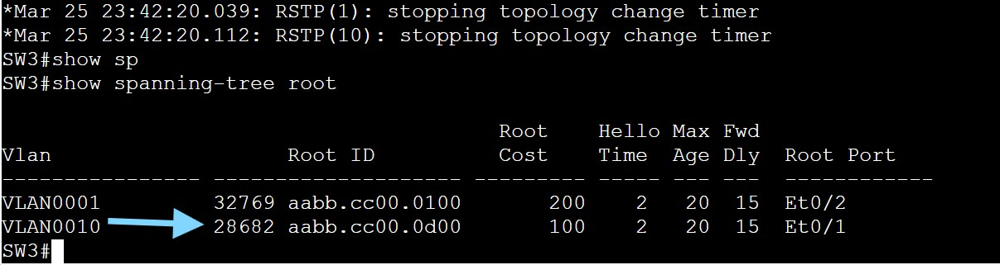
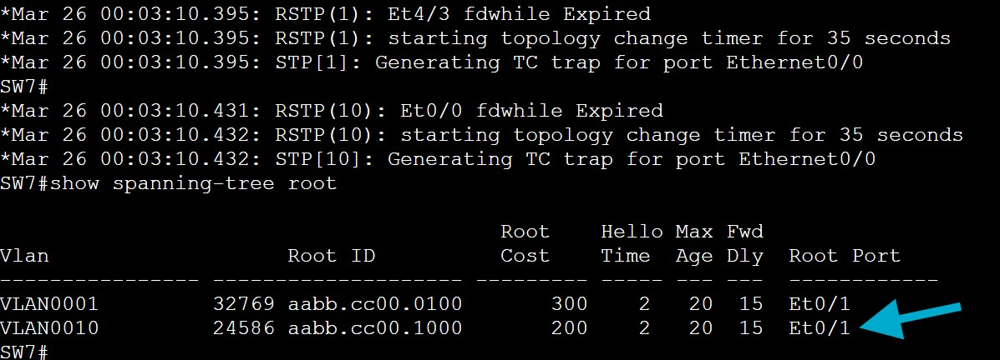
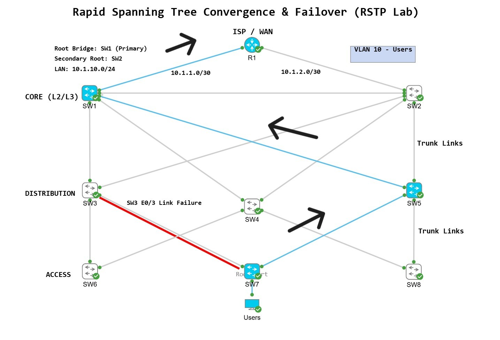
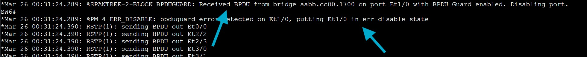

# Rapid Spanning Tree Convergence & Failover (RSTP Lab)

Lab was built using VMware Workstation with Cisco Modeling Labs v2.8.1 

All switches routers in this lab are running IOS XE images virtualized or containered

<br>

<br>

# Overview

This lab demonstrates the implementation and behavior of Rapid Spanning Tree Protocol (RSTP) in a switched Layer 2 network.

The objective is to analyze STP toplogy, validate loop prevention, and observe rapid failover during core switch and distribution switch link failures. RSTP provides significantly faster convergence compared to traditional STP by utilizing alternate ports and rapid state transitions.

<br>

# Objectives

Configure RSTP across multiple switches

Analyze root bridge election process

Simulate core switch failure and measure RSTP response

Observe port roles (Root, Designated, Alternate)

Simulate distribution layer link failure and measure failover response

Validate rapid convergence behavior

Plug a rogue switch into an access layer interface running port-fast & BPDU Guard and measure outcome.

Ensure loop-free topology under failure conditions and layer 3 connectivity inside and out of the LAN by R1 playing role of ISP WAN.

<br>

# Topology 

<br>



<br>

# Topology Description:

Multiple Layer 2 switches interconnected with redundant links

One switch elected as the Root Bridge with another core switch acting as secondary

Redundant paths available for failover scenarios

<br>

# VLAN & Interface Configuration

Access nodes (Users) are using VLAN 10. All trunks are configured to allow VLAN 10 over trunk links.

<br>

Access switches SW6,7,8 have extra interfaces installed and configured as access ports running port-fast and BPDU guard.

<br>


<br>

Link between core SW1 and SW2 is layer 2 link for the purpose of more RSTP options. 

<br>

# Configurations:

<br>

Full configurations are available in the configs/ directory

<br>

Initial IOS XE configurations I entered for all network nodes:

```
enable secret cisco
hostname {}
no ip domain lookup

line console 0
logging synchronous
exec-timeout 0 0
password cisco
login

line vty 0 4
logging synchronous
exec-timeout 15 0
password cisco
login
transport input ssh

copy running-config startup-config 
```

<br>

Alpine Linux Desktop to test end-to-end connectivity and configured with:
<br>sudo ifconfig eth0 10.1.10.19 netmask 255.255.255.0

<br>


SW1 & SW2 SVI
```
interface vlan 10
ip address 10.1.10.2 255.255.255.0
no shutdown

interface vlan 10
ip address 10.1.10.3 255.255.255.0
no shutdown
```
<br>

SW1 default route out of the network towards R1 (ISP) is:
```
ip route 0.0.0.0 0.0.0.0 10.1.1.1
```

SW2 default route out of the network towards R1 (ISP) is:
```
ip route 0.0.0.0 0.0.0.0 10.1.2.1
```

<br>

# Key Configuration Elements:

SW1 was manually configured as the root bridge by lowering bridge priority (primary). It can also be done using bridge-id numeric value divisble by 4096 increments.

RSTP enabled (spanning-tree mode rapid-pvst)

Root bridge priority on SW1 & SW2
```
spanning-tree vlan 10 root primary
spanning-tree vlan 10 root secondary
```
<br>


<br>


<br>

## Verify: show spanning-tree vlan 10

SW1 - root primary
<br>Et0/2               Desg FWD 100       128.3    P2p 
<br>Et0/3               Desg FWD 100       128.4    P2p 
<br>Et1/0               Desg FWD 100       128.5    P2p 

<br>

SW2 - root secondary
<br>Et0/2               Altn BLK 100       128.3    P2p 
<br>Et0/3               Root FWD 100       128.4    P2p 
<br>Et1/0               Altn BLK 100       128.5    P2p

<br>

## Port-Fast (applied to edge ports) SW6, SW7, SW8
```
interface range {interfaces}
switchport mode access
switchport access vlan 10
spanning-tree portfast
spanning-tree bpduguard enable
```

<br>

BPDU Guard (implemented)

Verified VLAN 10 SVIs were up, up, on SW1 and SW2
<br>show ip interface status

## Commands on trunk links between switches:
```
interface range {multiple interfaces}
switchport trunk encapsulation dot1q
switchport mode trunk
switchport trunk allowed vlan add 10
```
Pinged local SVI to ensure TCP/IP stack working

Pinged opposite core switch to ensure core-to-core link working

R1 pinged SW1 and SW3 cores successfully, - ISP/WAN links working

<br>


<br>

***************************************************************************************
<br>

# Scenario 1) 

RSTP root primary core SW1 fails, all interfaces shutdown. Simulating a failure.
 
<br>



<br>

## We can use these commands to verify:

Verify Spanning Tree Status: 
```
show spanning-tree
```
Originally, SW1 was root but now you can see SW3 (distr) detects root down, and changes RSTP root vlan 10 to SW2. SW2 backup root has now taken over the role of root bridge with the lowest bridge-id priority.

<br>

For fun we can use this command to see all the BPDUs in real time on SW3 before the failure:
```
debug spanning-tree bpdu
```
<br>



<br>

We can see the conversation and reconvergence of the switches on the CLI when we enable debugging: 
<br>debug spanning-tree events



<br>

Verify Root Bridge: 
<br>show spanning-tree root

We can now see root bridge has a higher priority value that belongs to SW2. SW2 with the priorty value of 28682 is now root for VLAN 10 - because SW1 is down / not responding / not sending BPDUs. 

SW1 will regain root status in VLAN 10 topology when it regains connectivity and is up,up. Remember, SW1 still has 'root primary' configuration so it
will take it back once it's up again. 

<br>



<br>

Failover testing was performed by shutting down all interfaces on SW1 root to simulate switch catastrophic failure. 

Observed Behavior:

SW2 secondary root now takes over as the VLAN 10 RSTP root core switch, changing all interfaces to designated / forwarding. 

No switching loops were introduced

Network connectivity was maintained

We could see SW3 detect something was wrong after not receiving BPDUs from root SW1 - and logs enable us to see the process.

<br>

***************************************************************************************

<br>

# Scenario 2) 

Distribution switch SW3 has a failure downstream towards access switch SW7, trunk is in down - no connectivity.

<br>

Failover testing was performed by manually shutting down a primary link between switches SW3 and SW7.

<br>


<br>


<br>

We can verify by checking the outgoing interface before and after the topology change:

Before = SW7 took E0/0 outgoing interface as path to root
<br>After = SW7 takes E0/1 outgoing interface as path to root

Originally topology path will return once SW3 regains connectivity on it's downstream trunk to SW7. 

<br>



<br>



<br>

## Observed Behavior:

Alternate port transitioned to forwarding state

Convergence occurred rapidly (sub-second to a few seconds)

No switching loops were introduced

Network connectivity was maintained

Traffic took alternative path to SW5 in order to reach the root / core layer. 

We can verify by using show spanning-tree commands and using debug logs to see the overhead conversation between switches. 

<br>

***************************************************************************************

# Scenario 3)

RSTP topology behaving normally. I configured port-fast and BPDU guard on SW6's access ports to test BPDU guard functionality. 

<br>

RSTP BPDU Guard Demonstration:

BPDU Guard testing was performed by plugging a rogue switch into SW6 at the access layer. 

<br>


<br>

Observed Behavior:

SW6 with port-fast and BPDU Guard enabled on its access ports, SW6 detects network node sending overhead messages
into the access interface. SW6 BPDU Guard immediately moves the interface into an err-disabled state.

<br>


<br> 

Let's watch it again but we will first enable debugging on SW6 so we can view the logs as the rogue switch gets plugged in:
```
show spanning-tree events
show spanning-tree bpdu
```
Here we see a level 2 Critical log from Spanning-Tree - BPDU Guard is blocking int E1/0, placing interface into err-disabled:

<br> 



<br> 

After the incident is over and the interface is ready to come back online -
We have to issue a 'shutdown' command on the err-disabled interface FIRST, and THEN issue the no shut.
This is required to bring an err-disabled port back up. 

When a BPDU was received on a PortFast-enabled interface with BPDU Guard configured, 
the switch immediately placed the port into an err-disabled state to prevent a potential loop.

<br> 

***************************************************************************************

<br>

# Final Results

Successful RSTP deployment

Rapid convergence observed during topology change

Loop-free network maintained under failure conditions

Efficient utilization of redundant paths

Distribution layer link failure - RSTP recovers.

Rogue switch plugged into access layer switch - BPDU Guard successfully detects - places into err-disabled state.

<br>

# Key Takeaways

A link failure at the distribution layer doesn't break the network. RSTP recovers

Demonstrated the ability to design, test, and validate Layer 2 failover scenarios using RSTP

Alternate ports enable near-instant failover

Redundancy at the core and distribution level is crucial to maintain network availability 

Proper Layer 2 design is critical for network stability and performance

Watched BPDU Guard block a rogue switch in real time (virtual machine)

Using debugging logs help us verify and understand each step of RSTP convergence

Understanding STP more from building it from the ground up with real Cisco IOS XE nodes. 

<br>

*********************************************************************************************


<br>


