# Rapid Spanning Tree Convergence & Failover (RSTP Lab)

Lab was built using VMware Workstation with Cisco Modeling Labs v2.8.1 

All switches and/or routers in this lab are running IOS XE images

 

 

# Overview

This lab demonstrates the implementation and behavior of Rapid Spanning Tree Protocol (RSTP) in a switched Layer 2 network.

The objective is to analyze STP toplogy, validate loop prevention, and observe rapid failover during core switch and distribution switch link failures. RSTP provides significantly faster convergence compared to traditional STP by utilizing alternate ports and rapid state transitions.

 

# Objectives

Configure RSTP across multiple switches

Analyze root bridge election process

Simulate core switch failure and measure failover response

Observe port roles (Root, Designated, Alternate)

Simulate distribution layer link failure and measure failover response

Validate rapid convergence behavior

Plug a rogue switch into an access layer interface running port-fast & BPDU Guard and measure outcome.

Ensure loop-free topology under failure conditions and layer 3 connectivity inside and out of the LAN by R1 playing role of ISP WAN.

 

# Topology 

 

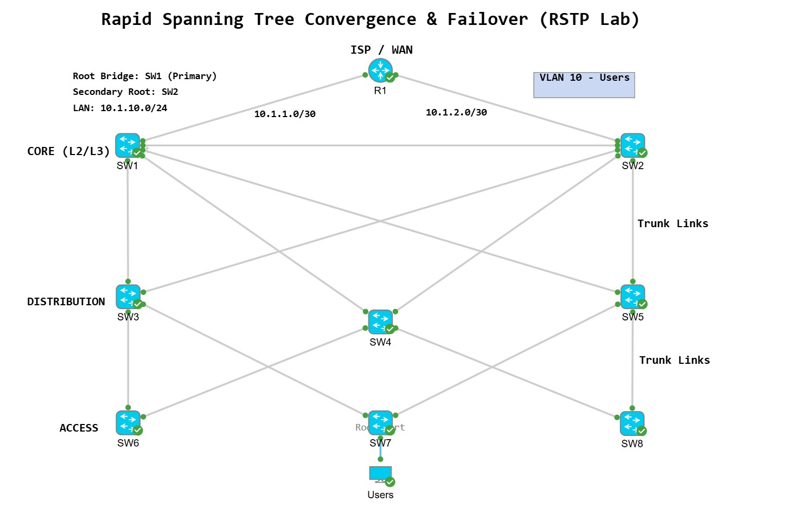

 

# Topology Description:

Multiple Layer 2 switches interconnected with redundant links

One switch elected as the Root Bridge with another core switch acting as secondary

Redundant paths available for failover scenarios

 

# VLAN & Interface Configuration

Access nodes (Users) are using VLAN 10. All trunks are configured to allow VLAN 10 over trunk links.

 

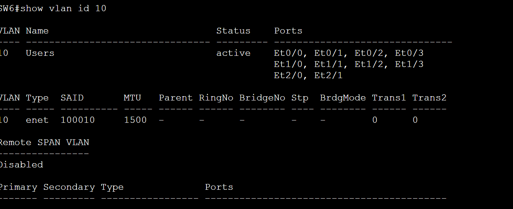

 

Access switches SW6,7,8 have extra interfaces installed and configured as access ports running port-fast and BPDU guard.

Link between core SW1 and SW2 is layer 2 link for the purpose of more RSTP options. 

 

# Configurations:

 

Full configurations are available in the configs/ directory

 

Initial IOS XE configurations I entered for all network nodes:

 enable secret cisco
 hostname {}
 no ip domain lookup

 line console 0
 logging synchronous
 exec-timeout 0 0
 password cisco
 login

 line vty 0 4
 logging synchronous
 exec-timeout 15 0
 password cisco
 login
 transport input ssh

copy running-config startup-config 

 

Apline Linux Desktop to test end-to-end connectivity and configured with:
 sudo ifconfig eth0 10.1.10.19 netmask 255.255.255.0
 ifconfig

 

SW1 & SW2 SVI
 interface vlan 10
  ip address 10.1.10.2 255.255.255.0
  no shutdown
 
 interface vlan 10
  ip address 10.1.10.3 255.255.255.0
  no shutdow

 

SW1 default route out of the network towards R1 (ISP) is:
 ip route 0.0.0.0 0.0.0.0 10.1.1.1

SW2 default route out of the network towards R1 (ISP) is:
 ip route 0.0.0.0 0.0.0.0 10.1.2.1

 

# Key Configuration Elements:

SW1 was manually configured as the root bridge by lowering bridge priority (primary). It can also be done using bridge-id numeric value divisble by 4096 increments.

RSTP enabled (spanning-tree mode rapid-pvst)

Root bridge priority tuning on SW1 & SW2
 spanning-tree vlan 10 root primary
 spanning-tree vlan 10 root secondary

 

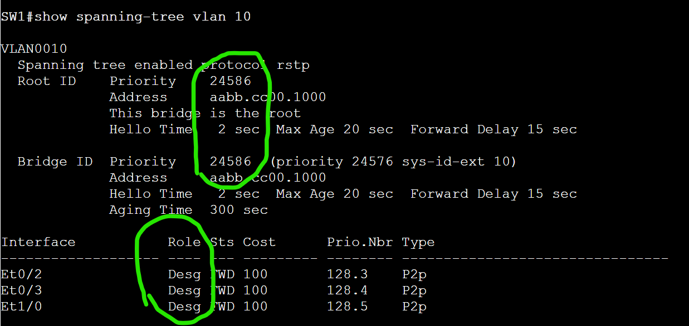

 

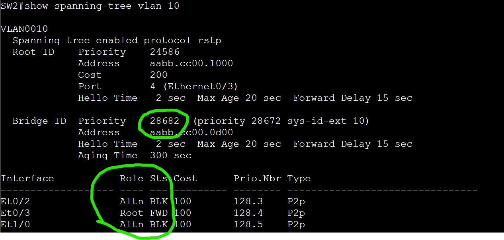

 

## Verify: show spanning-tree vlan 10

SW1 - root primary
 Et0/2               Desg FWD 100       128.3    P2p 
 Et0/3               Desg FWD 100       128.4    P2p 
 Et1/0               Desg FWD 100       128.5    P2p 

 

SW2 - root secondary
 Et0/2               Altn BLK 100       128.3    P2p 
 Et0/3               Root FWD 100       128.4    P2p 
 Et1/0               Altn BLK 100       128.5    P2p

 

## Port-Fast (applied to edge ports) SW6, SW7, SW8
 interface range {interfaces}
 switchport mode access
 switchport access vlan 10
 spanning-tree portfast
 spanning-tree bpduguard enable

 

BPDU Guard (implemented)

Verified VLAN 10 SVIs were up, up, on SW1 and SW2
 show ip interface status

## Commands on trunk links between switches:
 interface range {multiple interfaces}
 switchport trunk encapsulation dot1q
 switchport mode trunk
 switchport trunk allowed vlan add 10

Pinged local SVI to ensure TCP/IP stack working

Pinged opposite core switch to ensure core-to-core link working

R1 pinged SW1 and SW3 cores successfully, - ISP/WAN links working

 

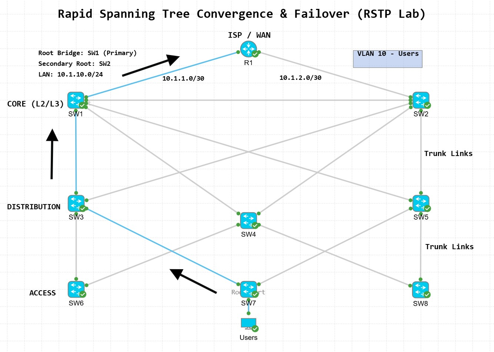

 

***************************************************************************************
 

# Scenario 1) 

RSTP root primary core SW1 fails, all interfaces shutdown. Simulating a layer 1 line protocol down.
 
 

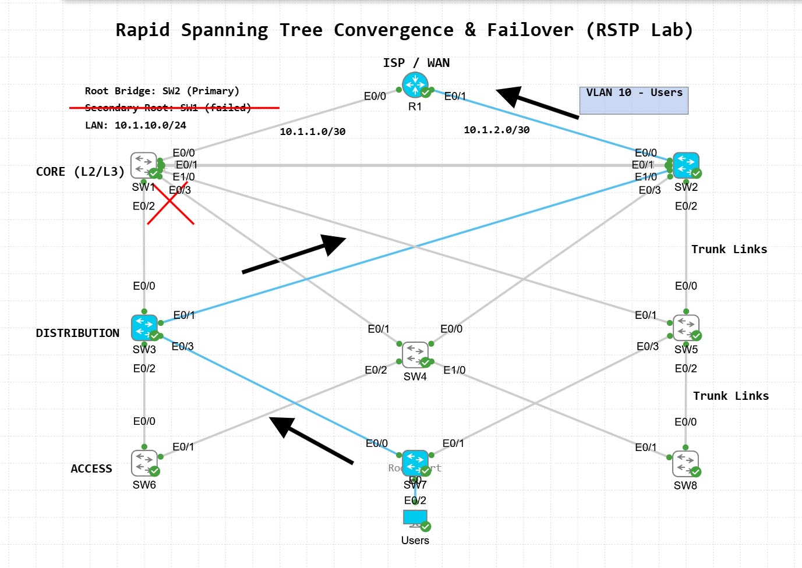

 

Verify Spanning Tree Status: 
 show spanning-tree

Verify Root Bridge: 
 show spanning-tree root

Verify Interface Roles: 
 show spanning-tree interface

 

Failover testing was performed by shutting down all interfaces on SW1 root primary to simulate switch catastrophic failure. 

Observed Behavior:

SW2 secondary root now takes over as the VLAN 10 RSTP root primary core switch, changing all interfaces to designated / forwarding. 

Convergence occurred rapidly (sub-second to a few seconds)

No switching loops were introduced

Network connectivity was maintained

 

***************************************************************************************

 

# Scenario 2) 

Distribution switch SW3 has a physical link failure downstream towards access switch SW7, trunk is in down.

 

Failover testing was performed by shutting down a primary link between switches SW3 and SW7

 

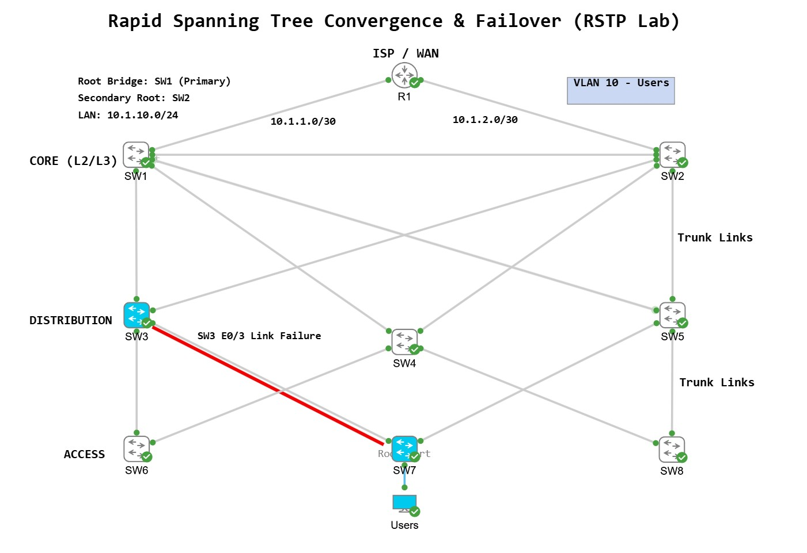

 

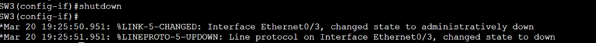

 

## Observed Behavior:

Alternate port transitioned to forwarding state

Convergence occurred rapidly (sub-second to a few seconds)

No switching loops were introduced

Network connectivity was maintained

Traffic took alternative path to SW5 in order to reach the root / core layer. 

 

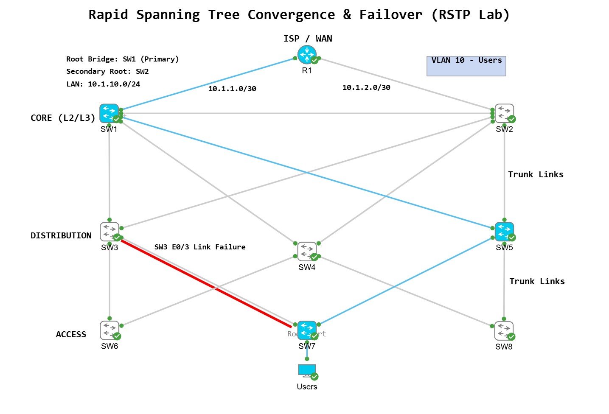

 

***************************************************************************************

# Scenario 3)

RSTP topology behaving normally. I configured port-fast and BPDU guard on SW6's access ports to test BPDU guard functionality. 

 

RSTP BPDU Guard Demonstration:

BPDU Guard testing was performed by plugging a rogue switch into SW6 at the access layer. 

 

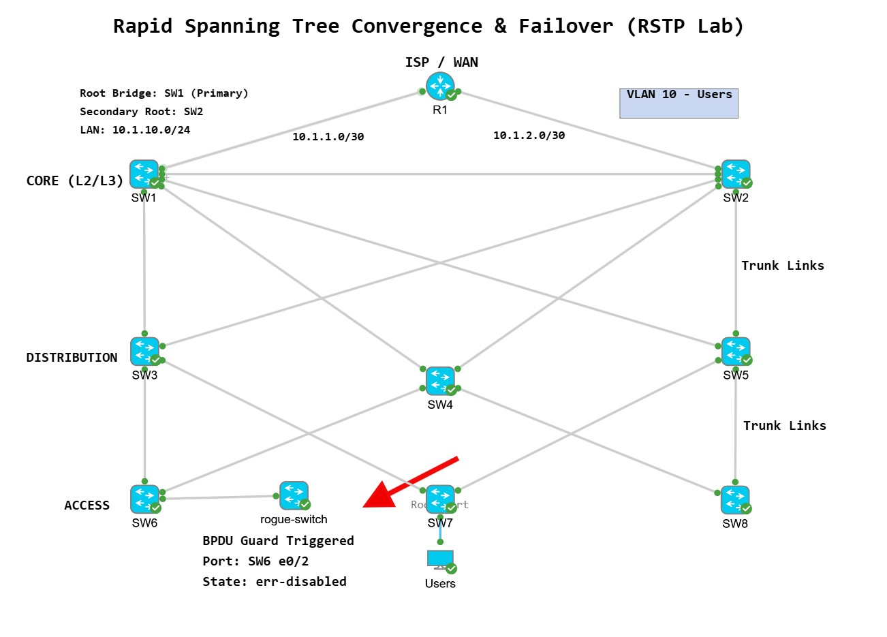

 

Observed Behavior:

SW6 with port-fast and BPDU Guard enabled on its access ports, SW6 detects network node sending overhead messages
into the access interface. SW6 bpduguard immediately moves the interface into an err-disabled state.

 

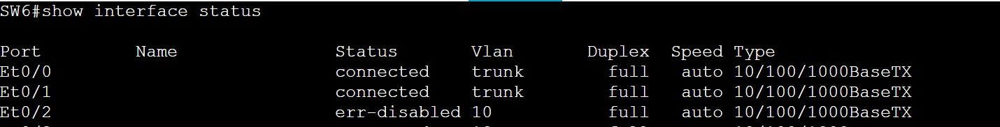

 

***************************************************************************************

 

*Surprise problem: During initial configurations, I missed a configuration on SW7 access port* 

When I was testing connectivity from end hosts to ISP WAN R1, pings failed.

Discovered SW7's interface connecting to users was not configured. Missed during initial config.

Solution:
 interface E0/2
 switchport mode access
 switchport access vlan 10
 spanning-tree portfast
 spanning-tree bpduguard enable

Resolved.

 

***************************************************************************************

 

# Final Results

Successful RSTP deployment

Rapid convergence observed during topology change

Loop-free network maintained under failure conditions

Efficient utilization of redundant paths

Distribution layer link failure - RSTP recovers.

Rogue switch plugged into access layer switch - BPDU Guard successfully detects - places into err-disabled state.

 

# Key Takeaways

A link failure at the distribution layer doesn't break the network. RSTP recovers

RSTP significantly improves convergence time over legacy STP

Demonstrated the ability to design, test, and validate Layer 2 failover scenarios using RSTP

Alternate ports enable near-instant failover

Root bridge placement directly impacts traffic flow

Redundancy at the core and distribution level is crucial to maintain network availability 

Proper Layer 2 design is critical for network stability and performance

Watched BPDU Guard block a rogue switch in real time

Understanding STP more from building it from the ground up with real Cisco IOS XE nodes. 

 

*********************************************************************************************

 

